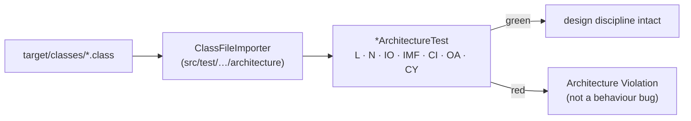

# ArchUnit Enforcement

How the architecture is enforced, given that in one Maven module the compiler does not
enforce any of it.

## What it encodes

- **Assertions on compiled bytecode**, not on behaviour. These are JUnit tests that read `.class` files.
- **One suite, one package tree.** The importer walks `target/classes`, so a single test can assert a rule spanning every layer.
- **`L2` carries the big rule.** In a single module every dependency is on every package's classpath, so a domain class importing Spring compiles without complaint. Nothing but `DomainPurityArchitectureTest` stands between that import and a merge — see [ADR-0001](../adr/0001-clean-architecture-layered-packages.md). The remaining families cover what no build tool could express anyway: naming placement, cycles, injection style, filter-chain shape, contract confinement.

## The rule families

| Family | Enforces |
|---|---|
| `L1`–`L4` | Layer direction; domain purity; controllers never touch repositories; use cases never import Spring Web |
| `N1`–`N5` | `*UseCase`, `*Controller`, `*Repository`, `*DataModel`, and exceptions live in their designated packages |
| `IO1`–`IO2` | `EntityManager`/`JdbcTemplate` only in infrastructure; `RestClient` only in the PokeAPI adapter |
| `IMF1` | Value objects are records or have only final fields |
| `CI1` | Constructor injection only — no field `@Autowired`, no field `@Value` |
| `SB-PA4` | Every `SecurityFilterChain` terminates in `.anyRequest()` |
| `OA1` | Every `@RestController` implements a generated `*Api` |
| `CY1` | No package cycles |

## The governance position

> Suppressing a governance rule is a **design decision**, not a quick fix. It belongs in an
> ADR, not in an inline annotation.

`FreezingArchRule` is forbidden and rules carry no allowlists. A frozen baseline turns a rule
into advice, and advice does not survive a deadline.

The fix for a red rule is almost always **move the dependency, not suppress the rule**.

## Related

[ArchUnit governance guide](../guides/archunit-governance.md) · [Package dependencies](package-dependencies.md)
