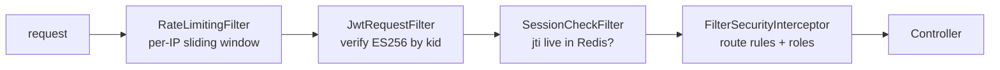

# Auth Filter Chain

The order is load-bearing.

## What it encodes

- **Rate limiting comes first.** An unauthenticated flood should be rejected before it costs a signature verification, let alone a Redis round trip.
- **Signature verification precedes the session check.** A forged token is rejected on cryptography, not on a database lookup.
- **`SessionCheckFilter` is what makes logout real.** A token with a perfect ES256 signature whose `jti` has been deleted from Redis is a 401. Without this filter, "logout" would be a client-side gesture and the token would remain valid until expiry.
- **Authorisation is last.** By the time route rules and roles are evaluated, the principal is known and trusted — so a **403 means authorisation, never a bad signature**. Chasing key configuration after a 403 wastes time.

## Fail-closed

If Redis is unreachable, the session check **fails closed**: the request gets 401. This is
the deliberate opposite of the cache adapter, which fails *open*. A cache is an
optimisation; a session store is a security control.

## Public routes

Deny by default. Every `SecurityFilterChain` terminates in `.anyRequest().authenticated()`,
asserted by ArchUnit `SB-PA4`. Public routes are an explicit enumerated allow-list —
registration, login, refresh, and the read-only browse and detail endpoints — never an
omission.

## Related

[Refresh token rotation](refresh-token-rotation.md) · [ADR-0005](../adr/0005-es256-jwt-jti-sessions.md)
