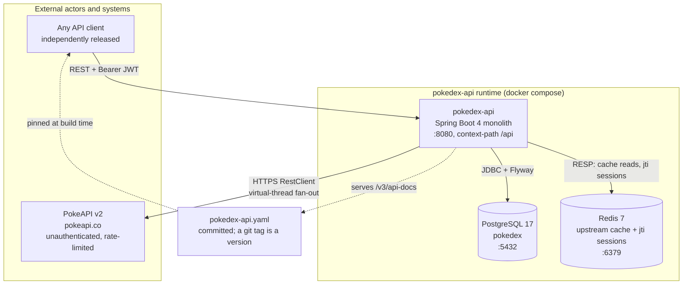

# C4 — Context and Containers

What runs, and who talks to what. This is the picture to draw on a whiteboard first.

## What it encodes

- **Three containers, no more.** No queue, no service mesh, no second service. The problem does not justify them.
- **Clients sit outside the boundary.** They are independently deployed and versioned, and the only thing they depend on is the published contract — see [ADR-0009](../adr/0009-no-bundled-client.md).
- **Two different relationships with Redis.** It is both an upstream cache and the `jti` session store. Cache reads fail *open*; session reads fail *closed*. That asymmetry is deliberate and is the single easiest thing to get wrong.
- **PokeAPI is the only outbound dependency** and it is public, unauthenticated, and rate-limited — which is why the edge into it is drawn as a bounded fan-out rather than a plain call.

## Related

[Package dependencies](package-dependencies.md) · [Deployment](deployment.md) · [Contract distribution](contract-distribution.md)
