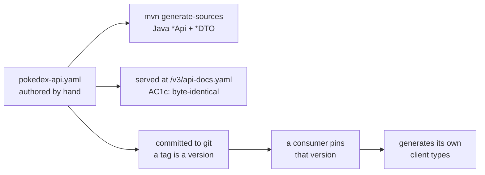

# Contract Distribution

How the OpenAPI document reaches consumers, and what stops it drifting.

## What it encodes

- **One source, three destinations.** The authored YAML produces the Java interfaces we implement, the document we serve, and the asset consumers pin. All three are the same file by construction.
- **`AC1c` asserts the served document is byte-identical to the authored one.** Without it, springdoc could quietly start generating from annotations and a deployed instance would advertise a contract we never published — a failure nothing else would catch.
- **The spec is committed, so git is the version store.** A consumer pins a tag and fetches the file from it. No registry, no hosted artifact, nothing that a local-only build cannot produce.
- **The obligation is one-way.** We publish and guarantee stability. We do not track, coordinate with, or build against any particular consumer.

## The gate

`make contract-check` runs `oasdiff` against the spec at the last tag. A breaking change to
an existing operation fails the check unless the tag is a new major version. It is part of
`make verify`, so it runs before every commit. What counts as breaking — including the two
that surprise people, making a response field nullable and tightening a validation
constraint — is enumerated in [contract-consumers.md](../guides/contract-consumers.md).

## Related

[ADR-0008](../adr/0008-openapi-contract-distribution.md) · [ADR-0002](../adr/0002-contract-first-openapi.md) · [Verification gates](verification-gates.md)
