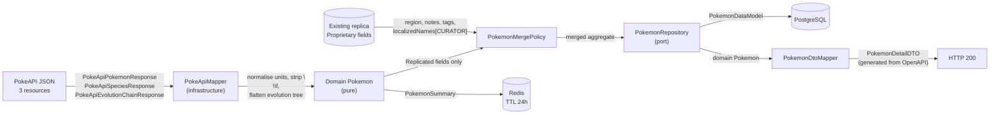

# Data Flow — Upstream JSON to a Persisted Aggregate

What happens to data at each stage, and where each field's authority comes from.

## The edge that matters

**`E → D`.** Proprietary fields enter the merge from the *existing replica*, never from
upstream. That single arrow is formal constraint F7 rendered as a picture, and it is the
difference between a re-sync that enriches and one that destroys.

## Transformations applied in the mapper

| Transformation | Why |
|---|---|
| `weight` hectograms → `Mass`, `height` decimetres → `Height` | Upstream units are not display units. Bulbasaur is `weight: 69` = 6.9 kg |
| Strip `\n` and `\f` from `flavor_text` | Upstream descriptions carry literal control characters that break layout |
| Filter `genera[]` and `flavor_text_entries[]` to `language.name == "en"` | Both arrays are multilingual; taking `[0]` gives you Japanese |
| Flatten `chain.evolves_to[]` recursively into an edge list | The chain is a **tree**, not a list. Eevee has 8 branches; a flat mapper truncates it |
| Seed `localizedNames` from `species.names[]` with `source = UPSTREAM` | 12 languages arrive free, so US03 demos with real data instead of empty fields |

Every one of these is a defect waiting to ship if the mapper is written from the field
names alone rather than from an inspection of real payloads.

## Related

[Sequence — listing a page](sequence-list-page.md) · [Replication state machine](replication-state-machine.md)
