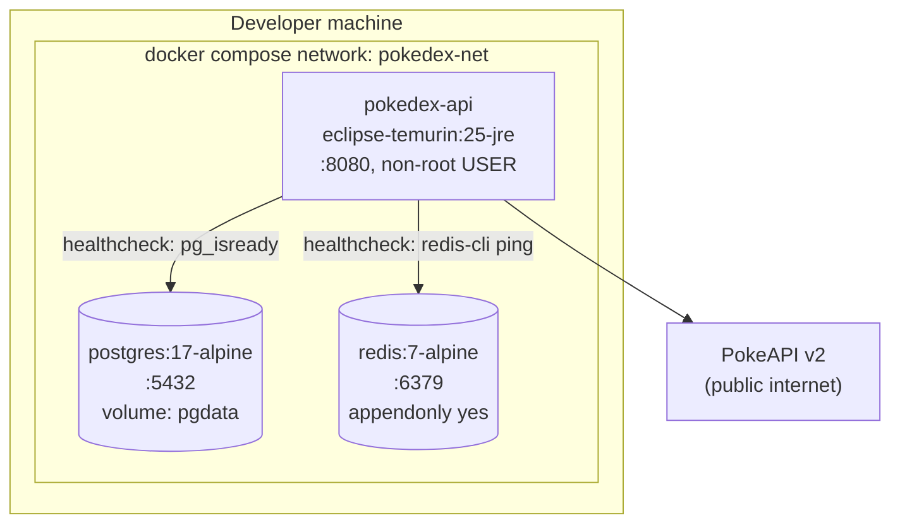

# Deployment

Where things run.

## What it encodes

- **`depends_on` uses `condition: service_healthy`** for both datastores, so the API never boots against a cold Postgres and Flyway never races the container's initialisation.
- **Non-root `USER`** in the image (`docker:S6471`), digest-pinned base (`docker:S6596`, `docker:S8431`).
- **Redis has `appendonly yes`** so the cache and `jti` sessions survive a container restart. Losing sessions on restart would log everyone out during a demo.
- **`pgdata` is a named volume.** `docker compose down -v` is the deliberate reset; `down` alone keeps your seeded data.
- **No client container.** This compose file starts a service, not an application — see [ADR-0009](../adr/0009-no-bundled-client.md).

## Related

[C4 context and containers](c4-context-container.md) · [Verification gates](verification-gates.md)
