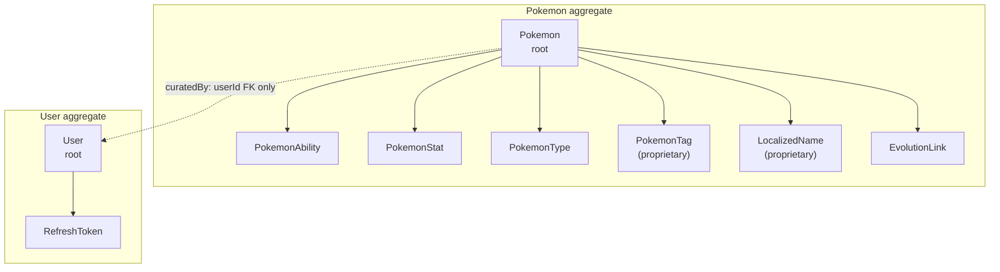

# Domain Aggregates

Which entity owns which. Aggregate boundaries are transaction boundaries are consistency
boundaries.

## What it encodes

- **Two roots.** Everything else is reached through one of them; there is no third entry point into the object graph.
- **Cross-aggregate references are id-only.** `Pokemon.curatedBy` holds a `UserId`, never a `User`. That keeps each aggregate independently loadable and enforces the rule that one transaction never modifies two aggregates.
- **Proprietary children are marked.** `PokemonTag` and `LocalizedName` belong to the curator, not to PokeAPI, and the merge policy treats them differently from everything else — see [Replication state machine](replication-state-machine.md).
- **Children cascade; the reference does not.** Deleting a `Pokemon` removes its abilities, stats, and tags. It does not touch the `User` who curated it.

## Related

[Entity relationships](entity-relationship.md) · [Replication state machine](replication-state-machine.md)
