# Element Relationships (C4 Level 3)

Every artifact and how it depends on the others. The blueprint before construction.

`-->` = compile-time dependency · `-.->` = runtime dependency · arrow points from dependent to dependency.

```mermaid
graph TD
    subgraph web["web (Spring Boot app)"]
        PokemonController
        LocalPokemonController
        SyncController
        SecurityController
        GlobalExceptionHandler
        SecurityConfig
        GEN["*Api + *DTO<br/>(generated from OpenAPI)"]
    end

    subgraph app["application"]
        ListPokemonUseCase
        GetPokemonDetailUseCase
        SyncPokemonUseCase
        ReSyncPokemonUseCase
        CreateLocalPokemonUseCase
        UpdateLocalPokemonUseCase
        DeleteLocalPokemonUseCase
        RegisterUserUseCase
        AuthenticateUserUseCase
        RefreshTokenRotationUseCase
    end

    subgraph domain["domain (framework-free)"]
        Pokemon
        User
        PokemonMergePolicy
        ReplicationState
        VOs["Value objects<br/>Mass, Height, Region, Tag, …"]
        PORTS["Ports<br/>PokemonRepository, PokemonCatalog,<br/>CachePort, TokenIssuer, PasswordHasher"]
    end

    subgraph infra["infrastructure"]
        JpaPokemonRepositoryAdapter
        JpaUserRepositoryAdapter
        PokeApiCatalogAdapter
        RedisCacheAdapter
        Es256TokenIssuer
        BCryptPasswordHasher
        DataModels["*DataModel + Flyway"]
    end

    PokemonController --> ListPokemonUseCase
    PokemonController --> GetPokemonDetailUseCase
    PokemonController -.->|implements| GEN
    LocalPokemonController --> CreateLocalPokemonUseCase
    LocalPokemonController --> UpdateLocalPokemonUseCase
    LocalPokemonController --> DeleteLocalPokemonUseCase
    SyncController --> SyncPokemonUseCase
    SyncController --> ReSyncPokemonUseCase
    SecurityController --> RegisterUserUseCase
    SecurityController --> AuthenticateUserUseCase
    SecurityController --> RefreshTokenRotationUseCase
    GlobalExceptionHandler -.->|maps exceptions| domain

    ListPokemonUseCase --> PORTS
    GetPokemonDetailUseCase --> PORTS
    SyncPokemonUseCase --> Pokemon
    ReSyncPokemonUseCase --> PokemonMergePolicy
    UpdateLocalPokemonUseCase --> Pokemon
    RegisterUserUseCase --> User
    Pokemon --> VOs
    Pokemon --> ReplicationState
    PokemonMergePolicy --> Pokemon

    JpaPokemonRepositoryAdapter -.->|implements| PORTS
    PokeApiCatalogAdapter -.->|implements| PORTS
    RedisCacheAdapter -.->|implements| PORTS
    Es256TokenIssuer -.->|implements| PORTS
    BCryptPasswordHasher -.->|implements| PORTS
    JpaPokemonRepositoryAdapter --> DataModels
```

## What it encodes

- **Every arrow from `infrastructure` into `domain` is `-.->|implements|`.** That is dependency inversion. No solid arrow ever leaves `domain`.
- **Controllers implement generated interfaces.** ArchUnit `OA1` fails the build on a hand-written endpoint.
- **One use case class per operation.** Command/query separation at the class level, which keeps each class small enough to test exhaustively.
- **`GlobalExceptionHandler` is the only element that touches domain exceptions from the web layer.** Exception-to-status mapping exists in exactly one place.

## Related

[Package dependencies](package-dependencies.md) · [ArchUnit enforcement](archunit-enforcement.md)
