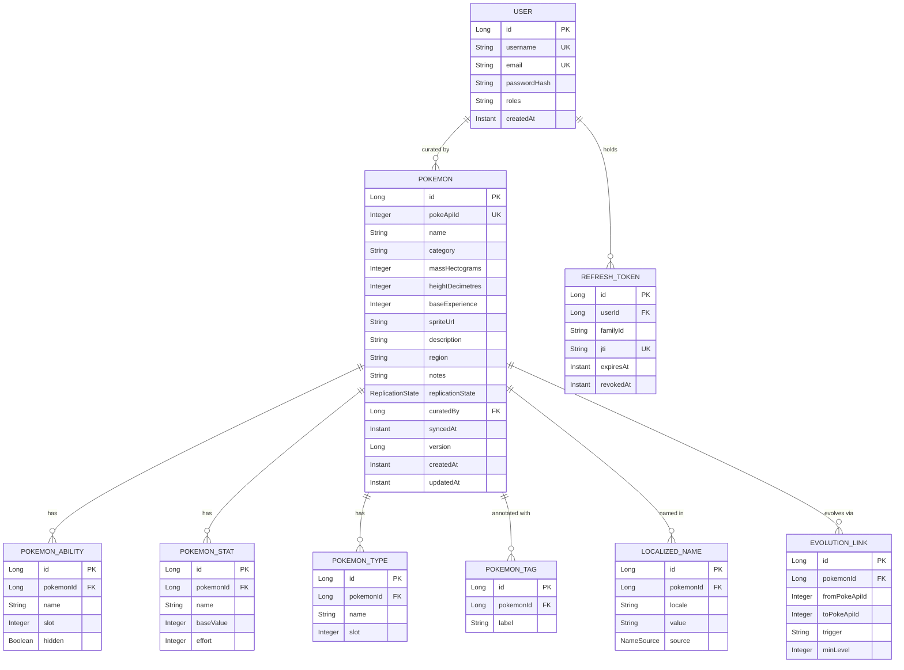

# Entity Relationships

The relational model. Cardinality, keys, and the columns that carry meaning.

## Columns that are doing real work

| Column | Why it exists |
|---|---|
| `pokemon.pokeApiId` **nullable** | A `DRAFT` record was created by hand and has no upstream counterpart yet. The unique index is partial: `WHERE poke_api_id IS NOT NULL` |
| `massHectograms`, `heightDecimetres` | Upstream units, stored raw. Conversion happens once, in the `Mass` / `Height` value objects — never at a call site |
| `localized_name.source` | `UPSTREAM` or `CURATOR`. This single discriminator is what lets re-sync replace upstream names while preserving curator overrides |
| `pokemon.version` | Optimistic locking. A concurrent edit gets 412, not a silent last-write-wins |
| `pokemon.updatedAt` | Auditing only. **Deletes are hard** — there is no `deletedAt`, no recoverable state, and no filter on every query |
| `refresh_token.familyId` | Groups all tokens descended from one login, so replaying a rotated token can revoke the whole family |

Both top-level tables satisfy the brief's requirement of a unique primary key plus well
beyond the minimum of two descriptive attributes.

## Related

[Domain aggregates](domain-aggregates.md) · [Replication state machine](replication-state-machine.md) · [Refresh token rotation](refresh-token-rotation.md)
