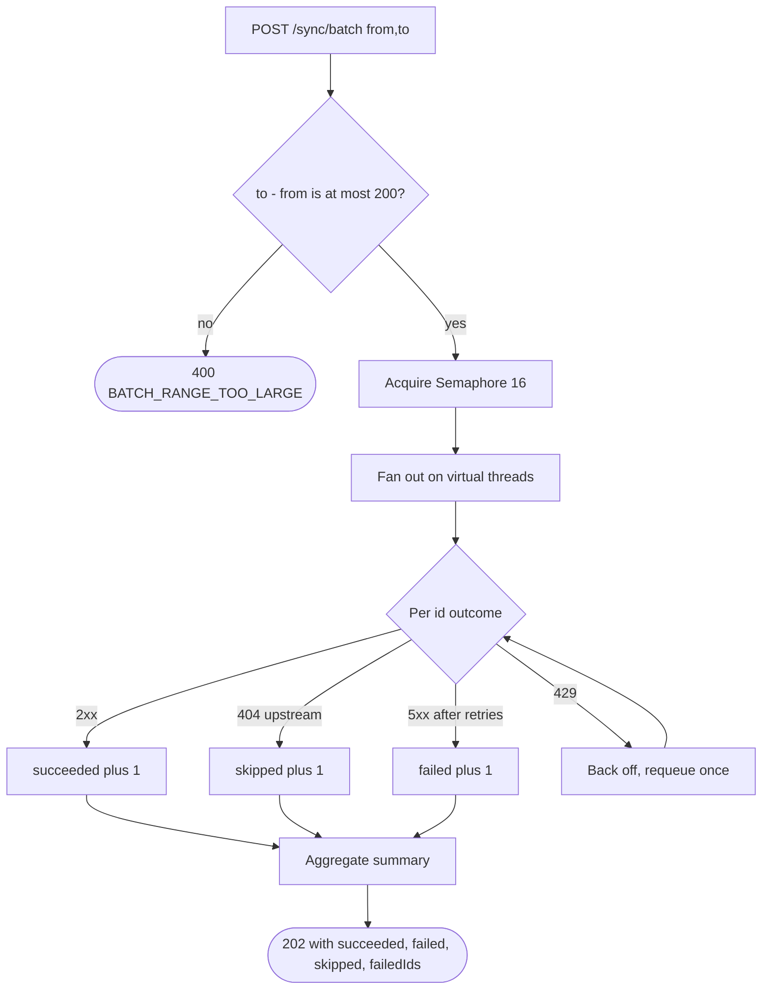

# Error Paths — Batch Sync

Partial success is the expected outcome, so the response models it explicitly.

## What it encodes

- **A batch never returns 500.** Some ids will fail against a public rate-limited API; that is normal, not exceptional.
- **202, not 200.** The work is accepted and partially complete; the summary says exactly how partially.
- **`failedIds` is returned** so a re-run targets only the remainder. Without it the caller has to diff two lists by hand.
- **The range cap is 200.** Unbounded ranges are how you get a self-inflicted outage during a demo — `from=1,to=1025` would issue roughly 3,000 requests.
- **429 gets one backoff-and-requeue**, then counts as failed. Retrying forever against a rate limiter makes the problem worse.

## Related

[Sequence — listing a page](sequence-list-page.md) · [ADR-0006](../adr/0006-redis-cache-pokeapi-fanout.md)
