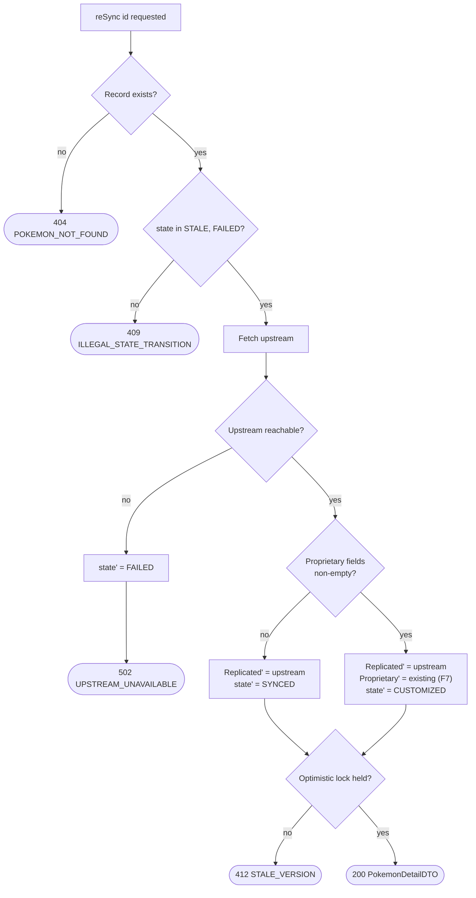

# Error Paths — Re-sync

Every branch of the most dangerous operation in the system.

## What it encodes

- **The state guard comes before the network call.** Re-syncing a record that is not `STALE` or `FAILED` is rejected at 409 without spending an upstream request.
- **A failed fetch transitions to `FAILED`**, it does not leave the record in limbo. `FAILED` is retryable; an undefined state is not.
- **`J` is the only branch that matters for correctness**, and both arms write replicated fields. The difference is solely whether proprietary fields are carried across.
- **The optimistic-lock check is last**, so a concurrent curator edit during a slow upstream call surfaces as 412 rather than silently overwriting.

## Related

[Replication state machine](replication-state-machine.md) · [Batch sync error paths](error-paths-batch-sync.md)
