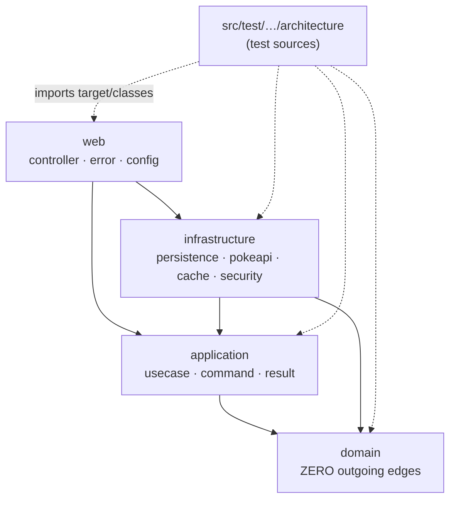

# Package Dependencies

The dependency rule, expressed as a graph. One Maven module, four layer packages — so this
graph is enforced by **ArchUnit**, not by the compiler ([ADR-0001](../adr/0001-clean-architecture-layered-packages.md)).

## What it encodes

- **`domain` has no outgoing edges.** It references no Spring, JPA, Jakarta, or Jackson type. Note what this is *not*: a classpath property. One module means every dependency is on every package's classpath, so `import org.springframework...` in a domain class **compiles fine**. `DomainPurityArchitectureTest` (`L2`) is what fails it, seconds later at test time.
- **`infrastructure` depends on `application`, not the reverse.** Adapters implement ports the domain owns. Dependency inversion at every boundary.
- **The architecture tests are test sources, not a module.** They walk `target/classes`, which is how one suite asserts rules spanning all four packages.

## What the graph cannot express

The graph shows direction. It does not stop a `*UseCase` landing in the wrong package, a
controller reaching for a repository, a field `@Autowired`, or a package cycle. Those are
ArchUnit's job too — see [ArchUnit enforcement](archunit-enforcement.md).

Which is the point worth holding onto: **every arrow above is a test**. Delete the test and
the arrow is a wish. That is why [`FreezingArchRule` is prohibited](../guides/archunit-governance.md).

## Related

[Element relationships](element-relationships.md) · [ArchUnit enforcement](archunit-enforcement.md) · [ADR-0001](../adr/0001-clean-architecture-layered-packages.md)
