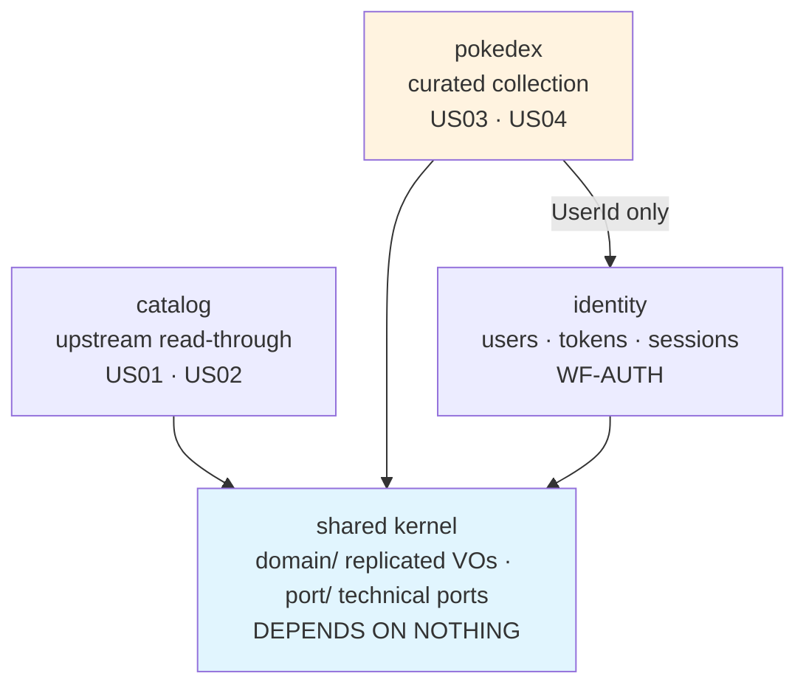
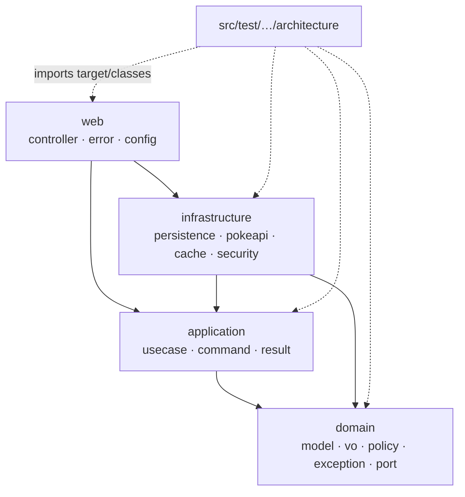

# Package Dependencies

Two rules in one graph: the **dependency rule** between layers, and the **context boundaries**
between concerns. One Maven module, so both are enforced by ArchUnit rather than the compiler
— [ADR-0001](../adr/0001-clean-architecture-layered-packages.md),
[ADR-0013](../adr/0013-bounded-context-packages.md).

## Contexts

`pokedex → identity` is the one cross-context edge, and it carries a **`UserId`, not a
`User`** — `ProprietaryFields.curatedBy` records who curated a record. A shared identifier,
not a shared model.

## Layers, inside every context

## What it encodes

- **`domain` has no outgoing edges.** It references no Spring, JPA, Jakarta, or Jackson type. Note what this is *not*: a classpath property. One module means every dependency is on every package's classpath, so `import org.springframework...` in a domain class **compiles fine**. `L2` is what fails it, seconds later at test time.
- **`infrastructure` depends on `application`, not the reverse.** Adapters implement ports the domain owns. Dependency inversion at every boundary.
- **`shared` depends on nothing** (`BC3`). A kernel that may depend on a context re-couples every context through the back door.
- **`shared/port` sits outside `domain`.** `CachePort` and `ClockPort` name no domain type, so filing them under `domain` would claim they are domain objects. They are still ports — `L5` keeps them framework-free.
- **Contexts meet through `domain` or not at all** (`BC4`). Importing another context's use case couples you to how it works rather than to what it means.
- **The architecture tests are test sources, not a module.** They walk `target/classes`, which is how one suite asserts rules spanning every context and layer.

## What the graph cannot express

The graph shows direction. It does not stop a `*UseCase` landing in the wrong package, a
controller reaching for a repository, a field `@Autowired`, or a package cycle. Those are
ArchUnit's job too — see [ArchUnit enforcement](archunit-enforcement.md).

Which is the point worth holding onto: **every arrow above is a test**. Delete the test and
the arrow is a wish. That is why [`FreezingArchRule` is prohibited](../guides/archunit-governance.md).

## Related

[Element relationships](element-relationships.md) · [ArchUnit enforcement](archunit-enforcement.md) ·
[ADR-0001](../adr/0001-clean-architecture-layered-packages.md) · [ADR-0013](../adr/0013-bounded-context-packages.md)
