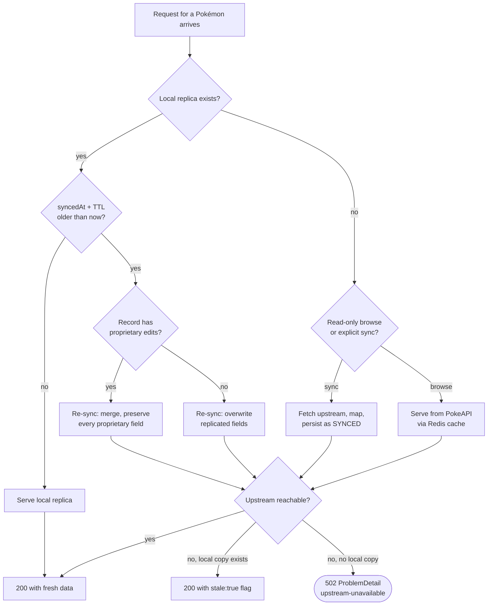

# Read Path Decision Tree

Which source answers a read, and what happens when upstream is down. The executor follows
this tree — no ambiguity, no stopping to ask.

`[Rectangle]` = action · `{Diamond}` = decision · `([Rounded])` = terminal

## What it encodes

- **Every decision node is exhaustive.** No unhandled case, no dangling branch.
- **`H` is the merge decision.** The two outcomes differ only in whether proprietary fields survive, and they always do when present.
- **`K` has three outcomes, and 500 is not one of them.** An upstream outage produces a 502 or a flagged-stale 200 — never an error attributed to us.
- **`stale: true` is a success response.** The client renders a subtle badge, not an error page.

## Related

[Sequence — listing a page](sequence-list-page.md) · [Replication state machine](replication-state-machine.md)
