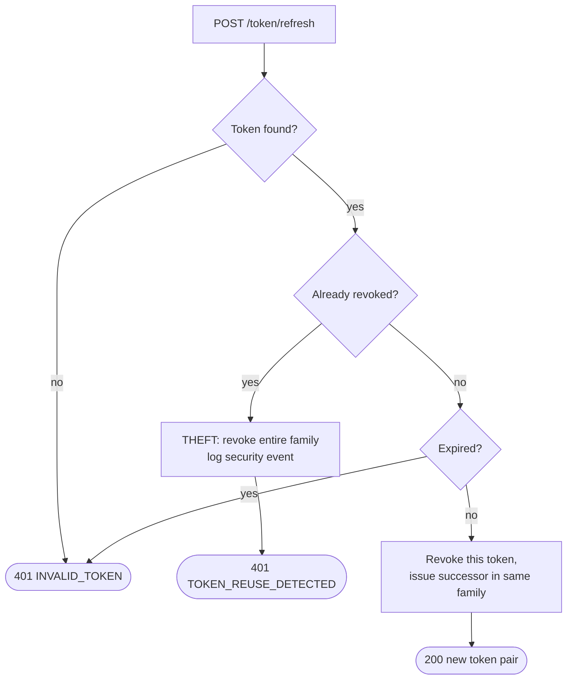

# Refresh Token Rotation

Rotation with family revocation. Replaying a rotated token is treated as theft.

## What it encodes

- **Every refresh rotates.** The presented token is revoked and a successor issued within the same `familyId`, established at login.
- **Reuse of a revoked token means one of two parties is an attacker** — the legitimate client would have moved on to the successor. We cannot tell which, so we revoke the whole family and force both to re-authenticate.
- **Family revocation is synchronous.** A stolen token must not survive the request that detected it. This is the one domain event that cannot be async.
- **Invariant I8 / constraint F11**: at most one live token per family, at any time.

## Related

[Auth filter chain](auth-filter-chain.md) · [ADR-0005](../adr/0005-es256-jwt-jti-sessions.md)
