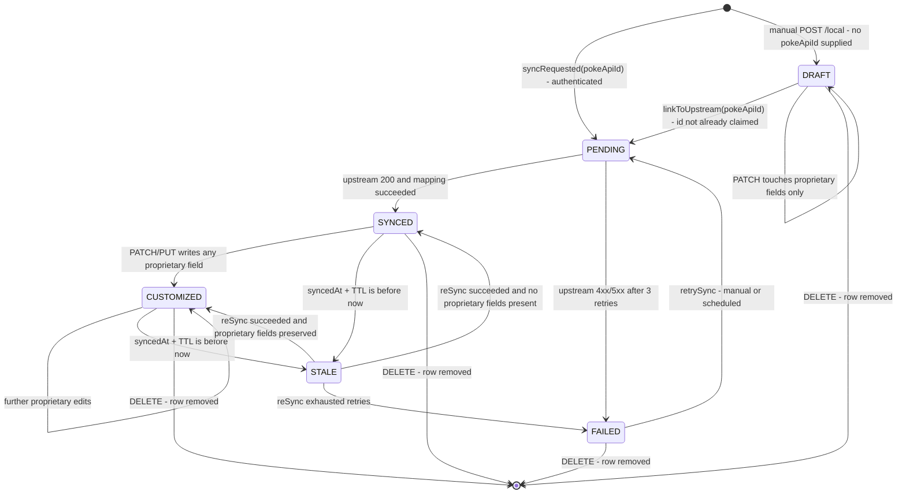

# Replication State Machine

The lifecycle of a locally stored Pokémon. This is the most important diagram in the
repository.

## Why this is a state machine and not a boolean

**Exactly one edge writes replicated fields from upstream**: `STALE → {SYNCED, CUSTOMIZED}`.
That edge runs through `PokemonMergePolicy`. There is no other path on which upstream data
can reach a persisted row.

An `isSynced` boolean would give you no such guarantee — you would have to audit every call
site to know whether curator data could be clobbered. Modelling the lifecycle explicitly
turns that audit into a single arrow.

`ReplicationState.transitionTo(next)` rejects any edge not on this diagram with
`IllegalStateTransitionException` → **409**.

## The two outcomes of a re-sync

| Guard | Result |
|---|---|
| No proprietary fields present | `STALE → SYNCED` — replicated fields overwritten wholesale |
| Proprietary fields present | `STALE → CUSTOMIZED` — replicated fields overwritten, **every proprietary field preserved byte-for-byte** |

The second is formal constraint **F7** and acceptance criterion **AC5**. It works because
`Proprietary ∩ Replicated = ∅` — the field sets are disjoint by construction, so there is
no conflict to resolve. See [ADR-0007](../adr/0007-proprietary-field-merge-policy.md).

## Invalid transitions, and why

| Forbidden | Reason |
|---|---|
| Any restore from a deleted record | `DELETE` removes the row — see [ADR-0010](../adr/0010-hard-deletes.md). Getting it back means re-syncing, which enters at `PENDING` as a genuinely new record with a new id |
| `PENDING → CUSTOMIZED` | You cannot customise what has not landed yet |
| `DRAFT → SYNCED` | A draft must be linked to an upstream id first, which is what `PENDING` represents |
| `SYNCED → PENDING` | Re-sync is a distinct operation with a distinct guard; it goes via `STALE` |

## Related

[Re-sync merge sequence](sequence-resync-merge.md) · [Re-sync error paths](error-paths-resync.md) · [ADR-0007](../adr/0007-proprietary-field-merge-policy.md)
