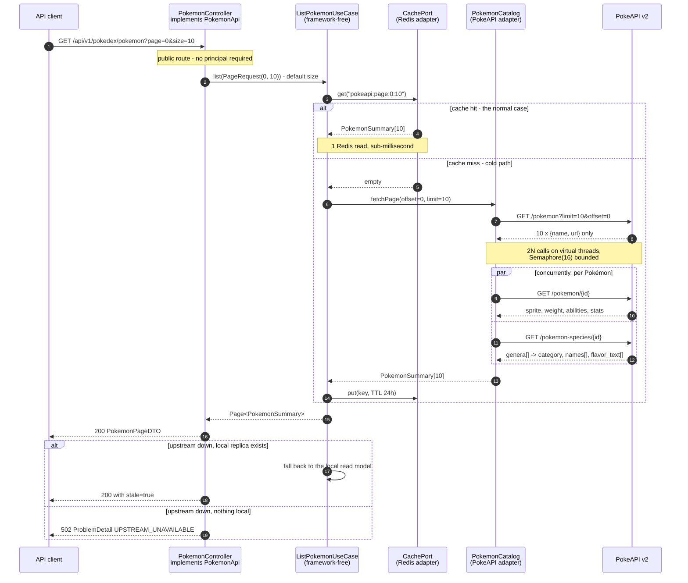

# Sequence — Listing a Page (the 1 + 2N problem)

The read that the upstream API makes hard, and the reason caching is load-bearing rather
than decorative.

## The arithmetic

`GET /api/v2/pokemon?limit=N` returns **only** `{name, url}`. The sprite, mass, and
abilities need `/pokemon/{id}` per row; the category (`genera[]` filtered to English) needs
`/pokemon-species/{id}` per row.

**1 + 2N upstream calls for one page.**

| Page size | Calls | Sequential at ~80 ms |
|---:|---:|---|
| 10 (default) | 21 | ~1.7 s |
| 100 (maximum) | 201 | ~16 s |

The cap at 100 is not arbitrary — it bounds the damage a single request can do to a free,
fair-use-limited public API. The default of 10 keeps the common case cheap.

## What it encodes

- **The use case knows nothing about Redis or HTTP.** It talks to `CachePort` and `PokemonCatalog`. Both are interfaces the domain owns.
- **The fan-out is bounded twice.** `Semaphore(16)` caps in-flight requests, and the page-size cap of 100 bounds how many a single request can queue. Unbounded on either axis gets us rate-limited mid-demo.
- **Virtual threads, not reactive.** 40 blocking calls are cheap on virtual threads, and the stack trace stays readable. WebFlux would bridge back to a pool at the JPA boundary anyway.
- **Upstream failure has two answers, and neither is 500.** With a local replica: 200 plus `stale: true`. Without: 502. A 500 would blame us for someone else's outage.

## Related

[Data flow — sync](data-flow-sync.md) · [ADR-0006](../adr/0006-redis-cache-pokeapi-fanout.md)
