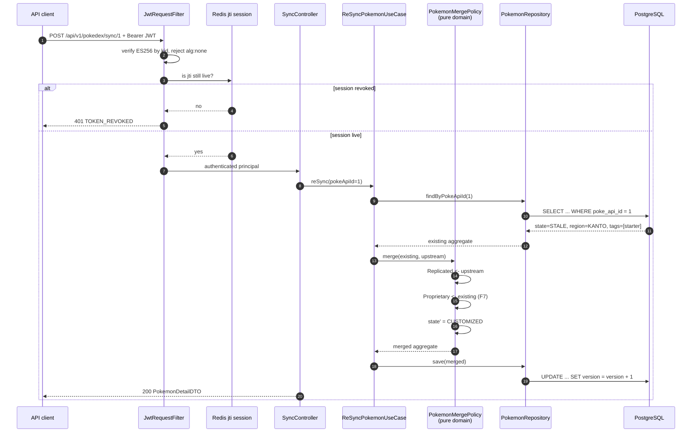

# Sequence — Re-sync Against a Customised Record

The write path that must not destroy curator work.

## What it encodes

- **`PokemonMergePolicy` is a pure function in `domain`.** No repository, no clock, no Spring. That is what makes F7 — "re-sync preserves every proprietary field" — testable as a **property** over generated field combinations rather than as an integration scenario.
- **The merge takes proprietary fields from the *existing record*, never from upstream.** Steps 12–13 are the whole decision, drawn.
- **Auth is two checks, not one.** A valid ES256 signature is not sufficient; the `jti` session must still be live. That is what makes logout real.
- **`version` increments**, so a concurrent curator edit gets 412 rather than silently losing.

## Related

[Replication state machine](replication-state-machine.md) · [Re-sync error paths](error-paths-resync.md) · [ADR-0007](../adr/0007-proprietary-field-merge-policy.md)
