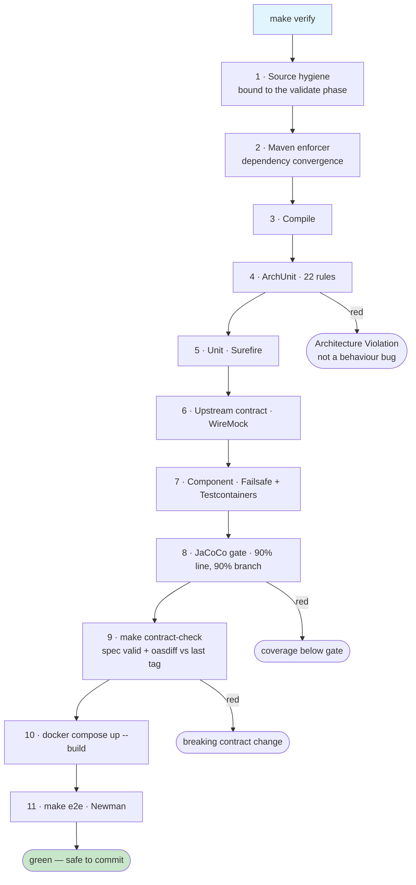

# Verification Gates

Everything runs locally. There is no pipeline — `make verify` is the gate of record.



## What each gate proves

| # | Gate | Proves | Command |
|---|---|---|---|
| 1 | Source hygiene | No file header; no `/**` outside generated sources; no `// NOSONAR` | bound to `validate` |
| 2 | Enforcer | No conflicting transitive versions | bound to `validate` |
| 3 | Compile | It builds across all four contexts | `mvn -B compile` |
| 4 | ArchUnit | Structural discipline held | `mvn -B test -Dtest='*ArchitectureTest'` |
| 5 | Unit | Domain and application logic is correct | `mvn -B test` |
| 6 | Upstream contract | We handle what PokeAPI actually sends, including failures | WireMock, in the unit phase |
| 7 | Component | It works against a real Postgres and Redis | `mvn -B verify` — **needs Docker** |
| 8 | JaCoCo | Coverage across merged tiers | fails the build below 90/90 |
| 9 | Contract | The spec is valid and no breaking change slipped in | `make contract-check` |
| 10 | Compose | The stack starts clean from cold | `docker compose up --build` |
| 11 | E2E | Every endpoint behaves against the running stack | `make e2e` |

## Outside the loop: mutation testing

```bash
make mutation      # PIT on domain (85%) and application (75%)
```

Deliberately **not** in `make verify`. It reruns the suite once per mutant, so it takes
minutes — and a slow commit loop is a disabled commit loop. Run it after finishing a domain
class and before opening a review.

It answers the question coverage cannot: not "did this line run" but "would a test have
noticed if this line were wrong". See
[testing pyramid](../handbook/testing-pyramid.md#mutation-testing--proving-the-tests-actually-test).

## Why ArchUnit runs before the unit tier

A layering violation produces dozens of confusing behaviour-test failures downstream.
Running the structural suite first means the failure is diagnosed as what it is:
*"Architecture Violation"*, one line, one cause.

## Gates that were considered and dropped

Because everything runs locally, a gate that needs a hosted service is a gate nobody runs
— which makes it cheap talk. These were removed rather than left as aspirations:

| Dropped | Why |
|---|---|
| SonarCloud quality gate | Needs a hosted analysis server. Coverage survives because JaCoCo enforces it in the build; duplication, code smells, and security-hotspot review do not, so they are not claimed |
| Automated CVE scanning | Needs a maintained advisory feed. `mvn versions:display-dependency-updates` is the local substitute, run deliberately rather than on every build |
| Sticky PR comments, build badges, matrix builds | No pipeline to produce them |

`gitleaks` stays — it is a local binary, runs in seconds, and the dev keystore password is
exactly the kind of thing that gets committed by accident.

## Related

[Build and test](../guides/build-and-test.md) · [ArchUnit enforcement](archunit-enforcement.md) · [Contract distribution](contract-distribution.md)
