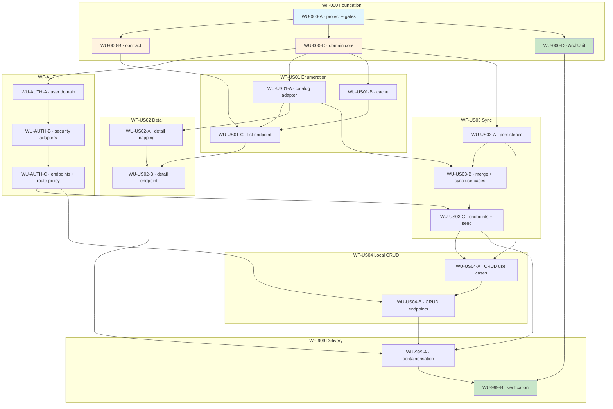

# Work Unit DAG

Execution order across all seven workflows, constructed by **backward induction** from the
acceptance criteria rather than forward from "foundation first". Nodes at the same level
with no edge between them may be built in any order or in parallel.

Driven by the [execution prompt](../prompts/pokedex-api-prompt.md), which groups these into
seven phases — one per workflow.

## What the shape tells you

**WU-000-C is the widest fan-out.** Once the ports are declared, four tracks proceed
independently — auth, the catalog adapter, the cache, and persistence. That is the payoff of
declaring ports before implementing anything.

**WU-000-D depends only on WU-000-A.** Build the ArchUnit suite early, not last. Rules that
exist before the code they govern fail on the first violation rather than during a cleanup
pass at the end.

**US03 sits on the critical path**, not US01. Persistence, the merge policy, and the sync
endpoints are what US04 needs before it can modify anything — and the merge policy is the
riskiest thing in the build.

**WU-US03-B has two parents, and the second is easy to miss.** It needs WU-US01-A as well as
WU-US03-A: a sync use case reads from `PokemonCatalog`, and the only implementation of that
port is the PokeAPI adapter built in US01. The port alone is enough to write the use case
against a mock, but not enough to prove it works.

**WF-AUTH blocks the mutating endpoints in US03 and US04**, which is why it is not deferred
to the end despite not being a numbered story.

**WU-000-B sits ahead of every controller**, and that is a topological fact rather than a
preference. No `@RestController` exists that is not an override of a generated `*Api`
method, so the contract must compile before any endpoint work starts. It also has consumers
outside this graph entirely: anything calling this API generates its own types from that
document, so the contract can be published and consumed before a single controller exists
([ADR-0008](../adr/0008-openapi-contract-distribution.md)).

## Related

[Work units](../work-units) · [Execution prompt](../prompts/pokedex-api-prompt.md)
