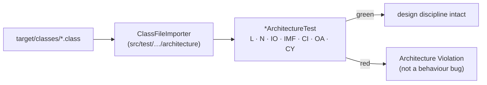

# ArchUnit Governance — the rules that read your code

So you understand *why* a perfectly valid-looking class fails the build before a human
ever reviews it — and why that is a feature.

**Read it when…** the build went red with an "Architecture Violation" instead of a normal
test failure, or before you add a class and want to know where it belongs.

> Canonical specs (don't restate — link):
> [`../workflows/WF-000-foundation.md`](../workflows/WF-000-foundation.md) §9 (the rule table),
> [ADR-0001](../adr/0001-clean-architecture-layered-packages.md) (why the module split exists).

---

## What it is

ArchUnit tests are JUnit tests that assert on **compiled bytecode**, not on behaviour.
They live in one place — `src/test/java/.../architecture/` — and scan the whole project: the
importer walks `target/classes`.



**These tests are the architecture.** One Maven module means every dependency sits on every
package's classpath, so a domain class importing Spring compiles cleanly — `L2` is the only
thing that fails it ([ADR-0001](../adr/0001-clean-architecture-layered-packages.md)). The
rest cover what no build tool expresses in any packaging: naming placement, cycles,
injection style, filter-chain shape.

That is precisely why a frozen or deleted rule is not a small change. It silently removes
the property it was asserting, and the build stays green while it does.

## The rules

| Family | Rule | Forbids / requires |
|---|---|---|
| **Layer** | `L1` | `application` must not depend on `web` or `infrastructure` |
| | `L2` | `domain` must not depend on Spring, JPA, Jakarta, or any other module |
| | `L3` | `*Controller` must not depend on `*Repository` or `*DataModel` |
| | `L4` | `*UseCase` must not import `org.springframework.web..` nor return `*DataModel` |
| **Naming** | `N1` | `*UseCase` lives in `..application.usecase..` |
| | `N2` | `*Controller` lives in `..web.controller..` |
| | `N3` | `*Repository` port in `..domain.port..`; adapter in `..infrastructure.persistence..` |
| | `N4` | `*DataModel` lives in `..infrastructure.persistence.model..` |
| | `N5` | Domain exceptions are `RuntimeException` subclasses in `..domain.exception..`; no `*Service` inside `usecase` |
| | `N6` | Everything in `..web.dto..` ends `DTO`, **and** no `*DTO` exists outside it |
| | `N7` | No `..domain..` class ends `DTO`, `Dto`, `DataModel`, `Entity`, `Request`, or `Response` |
| | `N9` | `..port..` holds only interfaces and carrier records; `*Adapter` is in `..infrastructure..` and implements a port |
| **I/O containment** | `IO1` | `EntityManager`, `JdbcTemplate`, `JpaRepository` only under `..infrastructure..` |
| | `IO2` | `RestClient` only under `..infrastructure.pokeapi..` |
| **Immutability** | `IMF1` | Every class in `..domain.vo..` is a record or has only final fields |
| **Construction** | `CI1` | No field `@Autowired`, no field `@Value`, no setter injection |
| **Security** | `SB-PA4` | Every `@Bean SecurityFilterChain` terminates with `.anyRequest()` |
| **Contract** | `OA1` | Every `@RestController` implements a generated `*Api` |
| **Cycles** | `CY1` | No package cycles anywhere under `com.elatusdev.pokedex` |

## Running them

```bash
mvn -B test -Dtest='*ArchitectureTest'
mvn -B test -Dtest='*ArchitectureTest' -Dsurefire.failIfNoSpecifiedTests=false
```

They run before the unit tier in `make verify`, so a structural break is diagnosed as a
structural break rather than buried in a wall of failing behaviour tests.

## Reading the failure

A red ArchUnit test names the class and the rule. The fix is almost always **move the
dependency, not suppress the rule**:

| Violation | Usual cause | Fix |
|---|---|---|
| `L2` — domain depends on Spring | An `@Service` or `@Entity` annotation crept into a domain class | Move the class to `infrastructure`, or define a port |
| `L4` — use case imports Spring Web | A use case returns `ResponseEntity` or reads `HttpStatus` | Throw a domain exception; let the context's advice map it |
| `N1`/`N2` — wrong package | A class was created next to its collaborator instead of in its layer | Move it |
| `N6` — a `*DTO` outside `web/dto` | A wire type was hand-written rather than generated from the contract | Add it to the spec and regenerate. Never hand-write a DTO |
| `N7` — a suffixed domain class | A projection leaked inward, or the three representations were confused | The domain type is the **unsuffixed** one. Rename it, or move it to the layer it belongs in |
| `N9` — an `*Adapter` implementing no port | The class adapts nothing; the name is aspirational | Either give it a port to implement, or stop calling it an adapter |
| `IO1` — `EntityManager` outside infrastructure | A test or use case reached for the DB directly | Go through the repository port |
| `OA1` — controller does not implement `*Api` | Someone hand-wrote an endpoint | Add it to the spec and regenerate |
| `CY1` — package cycle | Two packages reference each other | Extract the shared type, usually into `domain` |

## The governance position

> Suppressing a governance rule is a **design decision**, not a quick fix. It belongs in
> an ADR, not in an inline annotation.

`FreezingArchRule` is forbidden, and rules carry no allowlists. A frozen baseline turns a
rule into advice, and advice does not survive a deadline. Rules ship enforced or they do
not ship.

New rules join the gate automatically, because the suite selects every `*ArchitectureTest`
class rather than an enumerated list.

---

**Canonical specs (don't restate — link):**
[WF-000 §9](../workflows/WF-000-foundation.md) (the authoritative rule table) ·
[architecture.md](../diagrams/c4-context-container.md) (what the rules protect) ·
[`CLAUDE.md`](../../CLAUDE.md) (the suppression ladder)
