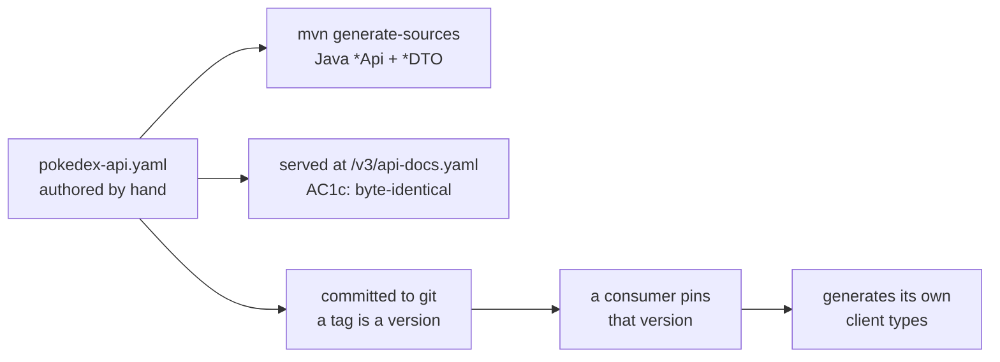

# Contract Consumers — you are not the only one reading this API

So you never break a consumer with a change that compiles perfectly here.

**Read it when…** you are changing a response shape, renaming a field, tightening a
validation rule, or adding a required request property.

> Canonical specs (don't restate — link):
> [ADR-0008](../adr/0008-openapi-contract-distribution.md) (how the contract crosses repos),
> [ADR-0009](../adr/0009-no-bundled-client.md) (why neither repo runs the other).

---

## The one rule

The OpenAPI document is a **published interface**, not an internal file.

Consumers of this API are not in this repository. They do not build with it, and they will
not fail when you change a field — they fail later, somewhere else, at runtime. The compiler
is not your drift detector across that boundary. Git tags and `oasdiff` are.

## How the contract travels



Our gate is `make contract-check`, which runs `oasdiff` against the spec at the last tag; a
breaking change to an existing operation fails it. It is part of `make verify`, so it runs
before every commit. What a consumer does on its side — pin, regenerate, diff-gate — is its
own business, and a well-built one will do exactly that.

## What counts as breaking

| Change | Breaking? | What to do |
|---|:---:|---|
| Add an optional response field | No | Ship it |
| Add an optional request field | No | Ship it |
| Add a new endpoint | No | Ship it |
| Add a new enum value **to a response** | Yes, in practice | Consumers switch exhaustively. Coordinate |
| Add a new enum value to a request | No | Ship it |
| Rename any field | **Yes** | New versioned path, or a major release |
| Remove a field | **Yes** | Deprecate first, remove in a major release |
| Make an optional request field required | **Yes** | Major release |
| Make a response field nullable | **Yes** | Consumers have non-null types. Major release |
| Tighten a validation constraint | **Yes** | Previously valid requests start failing |
| Loosen a validation constraint | No | Ship it |
| Change a status code for an existing condition | **Yes** | Consumers branch on it |
| Add a new error `code` value | No | Consumers must already have a default branch |

> **The nullability row is the one that catches people.** Adding `nullable: true` to an
> existing response field feels like a relaxation. To a TypeScript consumer it turns
> `string` into `string | null`, and every use site stops compiling.

## Changing a shape, safely

```bash
# 1. Edit the spec
$EDITOR src/main/resources/openapi/pokedex-api.yaml

# 2. Check before you commit
make contract-check          # openapi-spec-validator + oasdiff vs the spec at the last tag

# 3. Regenerate and verify here
mvn -B verify

# 4. Tag. The committed spec at that tag IS the published version.
# 5. Consumers adopt on their own schedule by bumping the version they pin.
```

Step 5 is a real pull request in the other repository, and that is the point — adopting a
contract change is a visible, reviewable decision rather than an accident.

## Deprecating rather than breaking

Most "breaking" changes have a non-breaking path if you are willing to carry both shapes
for a release:

1. Add the new field alongside the old one.
2. Mark the old one `deprecated: true` in the spec.
3. Release. The consumer migrates at its own pace.
4. Remove the old field in the next major release.

Two fields for one release cycle is cheap. A coordinated simultaneous deploy of two
independently released repositories is not.

## Things that surprise people

> **AC1c is not busywork.** It asserts the document served at `/v3/api-docs.yaml` is
> byte-identical to the authored file. If springdoc ever starts generating from annotations
> instead of serving the static resource, the served contract silently becomes a *different*
> document from the one consumers pinned — and nothing else would catch it.

> **A release without a published spec is a failed release.** Not a warning. The consumer
> has no way to pin a version that does not exist.

> **We publish; we do not coordinate.** There is no list of consumers to notify and no
> synchronised deploy. The stability guarantee is the coordination mechanism — that is
> what makes it worth enforcing rather than merely intending.

---

**Canonical specs (don't restate — link):**
[ADR-0008](../adr/0008-openapi-contract-distribution.md) (distribution and gates) ·
[openapi-contract-first.md](../guides/openapi-contract-first.md) (the local endpoint loop) ·
[verification-gates.md](../diagrams/verification-gates.md) (where the contract check sits)
