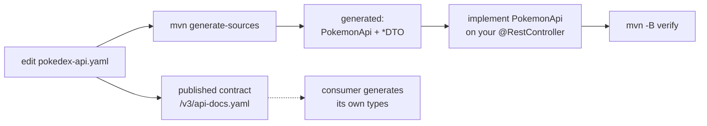

# OpenAPI Contract-First — the endpoint loop

So you never hand-write a controller signature or a DTO, and no consumer can disagree with
this service about the wire format.

**Read it when…** you are adding an endpoint, changing a response shape, or wondering why
your new `@RestController` fails the build.

> Canonical specs (don't restate — link):
> [ADR-0002](../adr/0002-contract-first-openapi.md) (why contract-first),
> [`../workflows/WF-000-foundation.md`](../workflows/WF-000-foundation.md) §3.2 (the endpoint table).

---

## The one rule

> Edit the **spec**, regenerate, then implement the generated **interface**.
> Never hand-write a controller signature. Never edit generated code.

`src/main/resources/openapi/pokedex-api.yaml` is the source of truth. Java interfaces and
DTOs are generated from it at build time. Consumers generate their own types from the same
file, which they fetch from the published contract — see
[contract consumers](contract-consumers.md). One document, no drift.



## Where things live

| Thing | Path |
|---|---|
| The spec | `src/main/resources/openapi/pokedex-api.yaml` |
| Generated API interfaces | `target/generated-sources/openapi/.../api/` |
| Generated DTOs (all suffixed `DTO`) | `target/generated-sources/openapi/.../dto/` |
| **Your** controller | `src/main/java/.../web/controller/PokemonController.java` |

## Generator configuration

Declared once in `pom.xml`:

| Setting | Value | Why it matters |
|---|---|---|
| `generatorName` | `spring` | Spring MVC interfaces |
| `interfaceOnly` | `true` | We write the controllers; the generator writes the contracts |
| `useTags` | `false` | Endpoints group by **first path segment**, not by spec `tags:` |
| `modelNameSuffix` | `DTO` | Every generated model ends in `DTO`, so ArchUnit can find them |
| `documentationProvider` | `springdoc` | Swagger UI serves the hand-written spec |

> **`useTags=false` is why your endpoints group by path segment.** Re-tagging a path in
> the YAML does nothing to the grouping. This trips people up every time.

## The loop, concretely

```bash
# 1. Edit the spec — add the path, the operation, the schemas
$EDITOR src/main/resources/openapi/pokedex-api.yaml

# 2. Regenerate
mvn -B generate-sources

# 3. Implement the generated interface. Your IDE will show the unimplemented method.
#    Controller stays thin: bind, delegate to a use case, map, return.

# 4. Verify
mvn -B verify
```

```java
@RestController
@RequestMapping("/v1/pokedex")
public class PokemonController implements PokemonApi {
    // override the generated methods; delegate to use cases
}
```

## Rules the build enforces

| Rule | What it forbids |
|---|---|
| `OA1` (ArchUnit) | A `@RestController` that does not implement a generated `*Api` |
| `B-20` (CRITICAL) | Hand-written backend API DTOs |
| Single-schema-source | Defining the same schema in two places — `$ref` it instead |

Two divergent generated classes from a duplicated schema produce a compile error that
reads as a type mismatch and takes an hour to diagnose. Define once, `$ref` everywhere.

## Gotchas

> **The context path is global.** `server.servlet.context-path=/api`, so a spec path of
> `/v1/pokedex/pokemon` is reachable at `/api/v1/pokedex/pokemon`. The spec does not
> include `/api`.

> **Generated sources are excluded from coverage, Sonar, and the copyright gate.** If your
> coverage number moves unexpectedly after a spec change, check the exclusion patterns.

> **Validation annotations come from the spec.** `minimum`, `maxLength`, `pattern`, and
> `required` become Bean Validation annotations on the generated DTO. Do not re-declare
> them by hand on a wrapper.

> **Parameter validation throws two exception types.** `ConstraintViolationException` from
> the `@Validated` proxy and `HandlerMethodValidationException` from MVC method validation.
> `GlobalExceptionHandler` maps both to an identical 400 shape — if you only map one, half
> your validation failures return 500.

---

**Canonical specs (don't restate — link):**
[ADR-0002](../adr/0002-contract-first-openapi.md) (the decision) ·
[workflow §3.2](../workflows/WF-000-foundation.md) (the endpoint table) ·
[archunit-governance.md](../guides/archunit-governance.md) (`OA1`)
