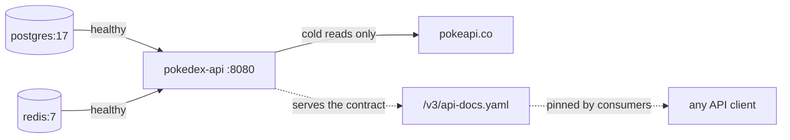

# Quickstart — your first ten minutes

So you can see the thing running before you read a word about how it works.

**Read it when…** you have just cloned the repo, or you are about to demo and want to
confirm the stack still comes up clean.

> Canonical specs (don't restate — link):
> [`../workflows/WF-000-foundation.md`](../workflows/WF-000-foundation.md) §8 (infrastructure),
> [`build-and-test.md`](../guides/build-and-test.md) (what to run before committing).

---

## The whole thing in one command

```bash
docker compose up --build
```

That starts Postgres and Redis, waits for both to report healthy, builds and starts the
API, applies the Flyway migrations, and seeds the original 151 Pokémon with proprietary
fields already populated.



> **This service ships no browser client.** It exposes an API and a published contract.
> Point whatever you like at `http://localhost:8080/api` — see
> [ADR-0009](../adr/0009-no-bundled-client.md).

| What | Where |
|---|---|
| API | http://localhost:8080/api |
| OpenAPI contract | http://localhost:8080/api/v3/api-docs.yaml |
| Swagger UI | http://localhost:8080/api/swagger-ui.html |
| Health | http://localhost:8080/api/actuator/health |
| Postgres | `localhost:5432` · db `pokedex` · user `pokedex` |
| Redis | `localhost:6379` |

## Demo credentials

| Username | Password | Roles |
|---|---|---|
| `demo` | `Demo123!` | `CURATOR` |
| `admin` | `Admin123!` | `CURATOR`, `ADMIN` |

Seeded by `V2__seed.sql`. They exist for demonstration and are not present in any
profile other than `dev`.

## Prove it works in four calls

```bash
# 1 — browse (public). Every row carries sprite, category, mass, abilities.
curl -s 'localhost:8080/api/v1/pokedex/pokemon' | jq '.content | length, .[0]'   # default size 10

# 2 — log in
TOKEN=$(curl -s localhost:8080/api/v1/security/login \
  -H 'Content-Type: application/json' \
  -d '{"username":"demo","password":"Demo123!"}' | jq -r .accessToken)

# 3 — annotate a Pokémon with proprietary fields (US03 + US04)
curl -s -X PATCH localhost:8080/api/v1/pokedex/local/1 \
  -H "Authorization: Bearer $TOKEN" -H 'Content-Type: application/json' \
  -d '{"region":"KANTO","tags":["starter","grass"],"notes":"Route 1 favourite","version":0}' | jq

# 4 — prove the error contract (US04 explicitly grades this)
curl -s -i localhost:8080/api/v1/pokedex/local/9999 | head -1
curl -s localhost:8080/api/v1/pokedex/local/9999 | jq
```

The last call returns `application/problem+json` with `code: POKEMON_NOT_FOUND` — RFC 9457,
not an ad-hoc error blob. See [ADR-0003](../adr/0003-rfc9457-problemdetail.md).

## Running without Docker

```bash
make keys                                  # generate the dev ES256 keystore
docker compose up -d postgres redis        # datastores only
mvn -B spring-boot:run                     # API on :8080
```

## Things that surprise people

> **The first page load is slow on a cold cache — by design.** PokeAPI's list endpoint
> returns only `{name, url}`, so a page of N costs `1 + 2N` upstream calls — 21 at the
> default page size of 10. The seed data and
> the Redis cache exist precisely to make this a one-time cost. If you wiped the volume,
> the first page is your penance. See [ADR-0006](../adr/0006-redis-cache-pokeapi-fanout.md).

> **`docker compose up` with no `--build` after a code change runs the old image.**
> The API image is not bind-mounted.

> **Component tests need a Docker daemon.** `mvn -B verify` runs Testcontainers. If Docker
> is not running you get a confusing connection error, not a helpful message.

## Where the real detail lives

| Need | Read |
|---|---|
| What the system is shaped like | [architecture.md](../diagrams/c4-context-container.md) |
| What to run before committing | [build and test](../guides/build-and-test.md) |
| Something is broken | [troubleshooting.md](../guides/troubleshooting.md) |
