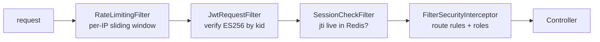
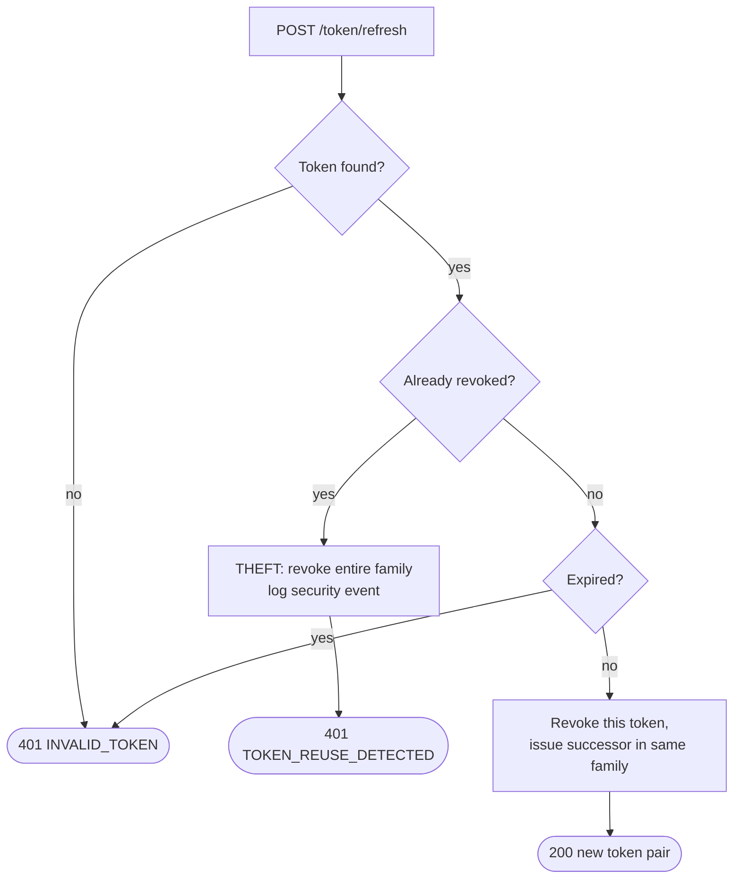

# Security & Auth — a field guide

So you can trace where authentication actually happens, and change a route's protection
without accidentally opening the whole API.

**Read it when…** you are adding an endpoint and deciding whether it is public, debugging
a 401 or 403, or touching anything to do with tokens.

> Canonical specs (don't restate — link):
> [ADR-0005](../adr/0005-es256-jwt-jti-sessions.md) (why ES256 and Redis sessions),
> [`../workflows/WF-000-foundation.md`](../workflows/WF-000-foundation.md) §9.5 (auth error matrix).

---

## The one rule

Deny by default. Every `SecurityFilterChain` terminates in `.anyRequest().authenticated()`,
and ArchUnit `SB-PA4` fails the build on any chain that does not. Public routes are an
explicit, enumerated allow-list — never an omission.

## Public vs protected

| Path | Method | Public? | Why |
|---|---|:---:|---|
| `/v1/security/register` | POST | yes | You cannot authenticate to create an account |
| `/v1/security/login` | POST | yes | Same |
| `/v1/security/token/refresh` | POST | yes | The access token is expected to be expired |
| `/v1/security/logout` | POST | no | Needs a `jti` to revoke |
| `/v1/security/me` | GET | no | It is the principal |
| `/v1/pokedex/pokemon/**` | GET | yes | Browsing the catalogue is read-only reference data |
| `/v1/pokedex/local/**` | GET | yes | Reading the curated catalogue |
| `/v1/pokedex/local/**` | POST PUT PATCH DELETE | no | Mutations require a curator |
| `/v1/pokedex/sync/**` | POST | no | Costs upstream calls; must be attributable |
| `/actuator/health` | GET | yes | Container healthcheck |
| everything else | — | no | `anyRequest().authenticated()` |

## The filter chain — order is load-bearing

`JwtRequestFilter` verifies the signature and claims. `SessionCheckFilter` then asks Redis
whether that `jti` is still live — this is what makes logout real. A token with a perfect
signature whose session has been deleted is a 401.

## Token design

| Concern | Choice |
|---|---|
| Algorithm | **ES256** (ECDSA P-256), allow-listed. `alg: none` and everything else rejected |
| Key source | Local PKCS12 keystore; `kid` identifies the key |
| Claims | `iss`, `aud` (allow-listed), `sub`, `jti`, `roles`, `exp`, `iat` |
| **No** claims | Any PII. Signed is not encrypted |
| Access TTL | 15 minutes |
| Refresh TTL | 7 days, rotated on every use |
| Revocation | `jti` in Redis; logout deletes it |

### Refresh-token rotation

Every refresh issues a new token and revokes the old one, within a `familyId` established
at login. Presenting an already-rotated token is treated as theft:

Invariant **I8** / constraint **F11**: at most one live token per family. Family revocation
is **synchronous** — a stolen token must not survive the request that detected it.

## Passwords

BCrypt, cost factor 12. Never SHA-256 — that is for digests, not passwords (`java:S5344`).
`PasswordHash.toString()` returns `"***"` so it cannot leak into a log line by accident,
and `UserSerializationTest` asserts it never appears in a response body.

## OWASP coverage

| Risk | Mitigation here |
|---|---|
| A01 Broken access control | Deny by default; `SB-PA4`; role checks on admin routes |
| A02 Cryptographic failures | ES256 asymmetric; BCrypt; no secrets in properties |
| A03 Injection | JPA parameterised queries; no native SQL; Bean Validation |
| A05 Misconfiguration | Security headers via the Spring Security DSL; no defaults shipped |
| A07 Auth failures | Rate-limited login; short access TTL; refresh rotation; real revocation |
| A08 Integrity | Bind to request DTOs, never entities — no mass assignment |
| A09 Logging | No PII, no tokens, no password hashes in logs. Security events audited |

## Gotchas

> **A 403 is authorisation, not a bad signature.** If the signature were wrong you would
> have a 401. Chasing key configuration after a 403 wastes time — check the route's role
> requirement instead.

> **Redis down means 401, not "allow".** Session checks fail closed. This is deliberate and
> is the opposite of the cache's fail-open behaviour.

> **The dev keystore is a throwaway.** `make keys` generates it. Its password lives in an
> environment variable and it is never committed. Anything else is a `gitleaks` failure.

---

**Canonical specs (don't restate — link):**
[ADR-0005](../adr/0005-es256-jwt-jti-sessions.md) (the decision and its trade-offs) ·
[WF-000 §9.5](../workflows/WF-000-foundation.md) (every auth error path) ·
[how-it-works.md](../diagrams/sequence-list-page.md) (auth inside a request trace)
