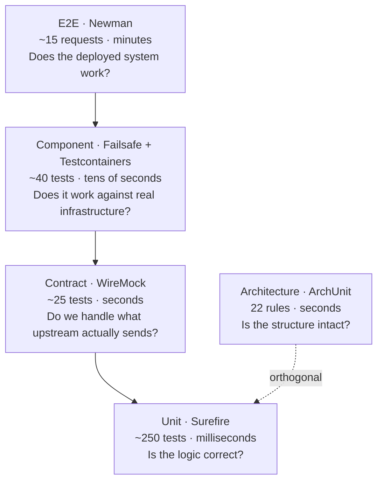

# Testing Patterns by Pyramid Layer

Each layer answers a different question. Writing the wrong kind of test at the wrong layer
is how suites become slow, brittle, and untrusted.



---

## The loop comes first

Every class in `..domain..` and `..application..` is written **test-first**: red, then
green, then refactor. Watch the test fail before you make it pass — a test that has never
been red has not been shown to test anything.

Adapters are the exception in form, not in spirit: a WireMock stub or a Testcontainers
fixture is written first, then the adapter that satisfies it.

Full directive: [`CLAUDE.md`](../../CLAUDE.md#tdd-is-not-optional).

---

## Unit — `*Test.java`

**Question**: is the logic correct?
**Scope**: one class. No Spring, no database, no network, no clock.
**Where**: `domain`, `application`

```java
class MassTest {
    @Test
    void should_convert_hectograms_to_kilograms() {
        assertThat(new Mass(69).toKilograms()).isEqualByComparingTo("6.9");
    }

    @Test
    void should_reject_non_positive_mass() {
        assertThatThrownBy(() -> new Mass(0))
            .isInstanceOf(InvalidPokemonDataException.class)
            .hasMessageContaining("must be positive");
    }
}
```

Use-case tests mock the ports and assert **both** state and interactions:

```java
@Test
void should_persist_and_mark_synced_when_upstream_returns_data() {
    when(catalog.findByPokeApiId(ID)).thenReturn(Optional.of(UPSTREAM));
    when(repository.save(EXPECTED)).thenReturn(EXPECTED);

    var result = useCase.sync(ID);

    assertThat(result.replicationState()).isEqualTo(SYNCED);
    assertThat(result.syncedAt()).isEqualTo(FIXED_NOW);

    verify(repository, times(1)).save(EXPECTED);
    verify(catalog, times(1)).findByPokeApiId(ID);
    verifyNoMoreInteractions(repository, catalog);
}
```

`verifyNoMoreInteractions` is the one people leave out, and it is the one that catches an
accidental extra save.

### Never `any()`

**`any()`, `anyString()`, `anyLong()`, and friends are banned in stubs and verifications.**

```java
when(repository.save(any())).thenReturn(saved);       // no
verify(repository).save(any(Pokemon.class));          // no — passes for ANY Pokemon
verify(repository).save(any());                       // no — passes for null

when(repository.save(EXPECTED)).thenReturn(EXPECTED);  // yes
verify(repository).save(EXPECTED);                     // yes
```

`any()` makes a test pass when the code saves the *wrong object*. It is the single most
common way a green suite hides a real defect — the assertion says "something was saved",
which was never the interesting question.

The narrow exception is a genuinely unknowable value, and even then use `argThat` with a
**real predicate** rather than a wildcard:

```java
// acceptable — the id is generated, but everything else is asserted
verify(repository).save(argThat(p ->
    p.pokeApiId().equals(ID) && p.replicationState() == SYNCED && p.region().isEmpty()));
```

If you reach for `any()` because building the expected value is awkward, that is a signal to
add a test data builder — not to weaken the assertion.

**Property tests where the rule is universal.** The merge policy is the example — it must
hold for *every* combination of populated proprietary fields, not one hand-picked case:

```java
@ParameterizedTest
@MethodSource("proprietaryFieldCombinations")
void should_preserve_every_proprietary_field_on_resync(Pokemon existing) {
    var merged = policy.merge(existing, differentUpstream());
    assertThat(merged.region()).isEqualTo(existing.region());
    assertThat(merged.notes()).isEqualTo(existing.notes());
    assertThat(merged.tags()).isEqualTo(existing.tags());
    assertThat(merged.curatorNames()).isEqualTo(existing.curatorNames());
    assertThat(merged.name()).isEqualTo(differentUpstream().name());   // replicated DID change
}
```

Note the last assertion. A test that only checks preservation would pass if the merge did
nothing at all.

---

## Contract — WireMock

**Question**: do we handle what upstream actually sends, including when it misbehaves?
**Scope**: the PokeAPI adapter against recorded payloads.

Every failure mode gets a test, because every one of them will happen:

| Stub | Asserts |
|---|---|
| 200 with a real recorded payload | Mapping is correct, units converted, control characters stripped |
| 200 with a **branching** evolution chain (Eevee, 8 children) | The recursive flattener does not truncate |
| 200 with only non-English `genera` | We fail loudly rather than showing Japanese |
| 404 | `PokemonNotFoundUpstreamException`, **no retry** |
| 500 | 3 retries, then `UpstreamUnavailableException` |
| Fixed delay beyond the read timeout | `UpstreamTimeoutException` |
| Malformed JSON | A mapping exception, never a `NullPointerException` |
| 429 | Backoff, single requeue |

Recorded fixtures come from the real API and are refreshed deliberately, not silently.

---

## Component — `*ComponentTest.java`

**Question**: does it work against real infrastructure?
**Scope**: full Spring context, Testcontainers Postgres and Redis, real Flyway migrations.
**Runner**: Failsafe, under `mvn -B verify`. **Needs Docker.**

```java
@SpringBootTest
@AutoConfigureMockMvc
@Testcontainers
class LocalPokemonComponentTest {

    @Test
    void should_return_404_problem_detail_when_record_absent() throws Exception {
        mockMvc.perform(get("/api/v1/pokedex/local/9999"))
            .andExpect(status().isNotFound())
            .andExpect(content().contentType("application/problem+json"))
            .andExpect(jsonPath("$.code").value("POKEMON_NOT_FOUND"));
    }
}
```

What belongs here and nowhere else:

- **Postgres-specific behaviour** — the partial unique index and cascade deletes. H2 would pass and production would fail.
- **The full filter chain** — auth enforcement, a revoked `jti`, refresh-token family revocation.
- **Optimistic locking** under genuinely concurrent updates.
- **Flyway** applying cleanly from empty.
- **Every error row** in the error matrix, asserting the exact status *and* the `code`.

> **Testcontainers, not H2.** H2's dialect diverges enough that a green H2 suite can hide a
> broken production query. The container costs seconds; the false confidence costs an
> afternoon.

---

## Architecture — `*ArchitectureTest.java`

**Question**: is the structure intact?
**Scope**: compiled bytecode across the whole project. Orthogonal to the pyramid — it tests
shape, not behaviour.

Runs before the unit tier in `make verify`, so a layering violation is reported as
*"Architecture Violation"* rather than buried under thirty confusing behaviour failures.
See [ArchUnit enforcement](../diagrams/archunit-enforcement.md).

---

## E2E — Newman

**Question**: does the deployed system work end to end?
**Scope**: the compose stack with seeded data.

Nine mandatory scenarios per entity: create 201, create duplicate 409, get 200, get 404,
list 200, update 200, update 404, delete 204, get-after-delete 404. Plus cross-cutting auth
enforcement (401) and the merge policy (AC5).

Kept deliberately thin. E2E tests are slow and flaky by nature; they prove the wiring, not
the logic.

---

## Mutation testing — proving the tests actually test

Coverage tells you a line **executed**. It does not tell you an assertion would have
noticed if that line were wrong. Mutation testing answers the second question, which is the
one that matters.

**PIT** (`pitest-maven`) rewrites the bytecode — flipping `>` to `>=`, replacing a return
with `null`, removing a method call — reruns the tests, and reports whether anything failed.
A mutant that survives is a line your suite covers but does not verify.

```bash
make mutation      # mvn -B test-compile org.pitest:pitest-maven:mutationCoverage
open target/pit-reports/index.html
```

### Where we run it, and where we do not

| Module | Mutation threshold | Why |
|---|:---:|---|
| `domain` | **85%** | Pure logic, no I/O, fast to mutate. This is where correctness lives — invariants, the merge policy, the state machine |
| `application` | **75%** | Use cases against mocked ports. Slightly lower because some mutants are only observable through a port interaction |
| `infrastructure` | not run | Mutants mostly land in mapping and framework glue; the signal-to-noise ratio does not justify the runtime |
| `web` | not run | Same — controllers are thin by design, so there is little to mutate |

```xml
<plugin>
  <groupId>org.pitest</groupId>
  <artifactId>pitest-maven</artifactId>
  <configuration>
    <!-- the wildcard is the context: catalog, pokedex, identity, shared -->
    <targetClasses><param>com.elatusdev.pokedex.*.domain.*</param></targetClasses>
    <mutationThreshold>85</mutationThreshold>
    <mutators><mutator>STRONGER</mutator></mutators>
    <timestampedReports>false</timestampedReports>
  </configuration>
  <dependencies>
    <dependency>
      <groupId>org.pitest</groupId><artifactId>pitest-junit5-plugin</artifactId>
    </dependency>
  </dependencies>
</plugin>
```

### It is not part of `make verify`

Mutation testing is **slow** — minutes, not seconds — because it reruns the suite once per
mutant. Putting it in the commit loop would get it disabled within a week.

Run it deliberately: after finishing a domain class, before opening a review, and whenever
coverage looks suspiciously high. `make verify` stays fast so it stays used.

### Reading a surviving mutant

A survivor is one of three things, and the diagnosis matters:

| Survivor | Diagnosis | Action |
|---|---|---|
| Changed a boundary (`<` → `<=`) and nothing failed | A genuine gap — no test at the boundary | Add the boundary case. This is the most common and most valuable finding |
| Removed a call and nothing failed | Either the call is unnecessary, or an interaction is unverified | Delete the call, or assert the interaction |
| Changed a log message, `toString`, or an equals on a field nothing reads | Equivalent mutant — no behaviour changed | Exclude it, with a comment saying why |

Equivalent mutants are real and unavoidable; that is why the threshold is 85% and not 100%.
Chasing the last few percent produces tests that assert implementation details.

### What it caught here

Worth naming, because it justifies the runtime: the first PIT run on `PokemonMergePolicy`
survived a mutant that removed the proprietary-field copy entirely. The example-based test
passed because its fixture had **empty** proprietary fields — so "preserved" and "cleared"
looked identical. That is precisely the F7 data-loss bug the policy exists to prevent, and
line coverage was 100% the whole time.

The fix was the property test in §Unit, over generated field combinations.

---

## Rules that apply at every layer

| Rule | Why |
|---|---|
| Name tests `should_X_when_Y` | The failure output reads as a sentence describing what broke |
| Assert the **value**, never `!= null` | `assertThat(x).isNotNull()` passes for every wrong answer |
| Assert state **and** interactions | A test that only checks the return value misses a duplicate save |
| **Never `any()`** | It passes when the code saves the wrong object. Use the exact value, or `argThat` with a real predicate |
| Never `Thread.sleep` | Inject `ClockPort`. Sleeping tests are slow *and* flaky (`java:S2925`) |
| One behaviour per test | A test named `should_do_everything` fails for reasons you cannot infer |
| No conditionals in a test body | An `if` means it is two tests |
| A disabled test needs a written reason | Otherwise it is deleted (`java:S1607`) |
| Extract fixtures into builders | `aPokemon().withRegion(KANTO).build()` — not thirty lines of setup per test |

## Coverage

90% line and branch on **new code**, merged across Surefire and Failsafe before reporting —
one tier alone under-counts significantly.

Coverage is a smoke detector, not a goal. 100% coverage with `isNotNull()` assertions is
worse than 80% with real ones, because it produces confidence that is not earned — and
mutation testing is how you find out which one you have.

## Related

[Design patterns](design-patterns.md) · [Persistence patterns](persistence-patterns.md) · [Build and test](../guides/build-and-test.md)
