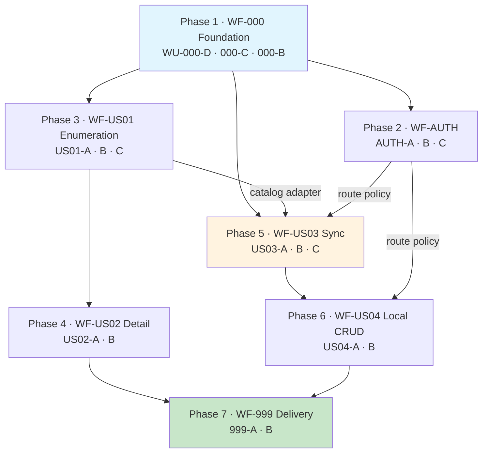

# Pokédex API — Execution Prompt

> **Rules**: [`../../CLAUDE.md`](../../CLAUDE.md) — non-negotiable.
> **Spec**: [`../workflows/`](../workflows) — seven workflows. Read [WF-000](../workflows/WF-000-foundation.md) first; it owns the shared specification.
> **Decisions**: [the ADR index](../../README.md) — already made. Do not relitigate them in code.
>
> **Scope**: this service, to green against every acceptance criterion in the seven workflows. No browser client — [ADR-0009](../adr/0009-no-bundled-client.md).
> **Succeeded by**: `/retro` — write the retrospective before closing.

This document is the **order of operations**, and it is the only entry point you need. Seven
phases, one per workflow, in dependency order. Every work unit in the repository appears in
exactly one phase. Work the phases in order and nothing is left over.

## How to use this document

Each phase below gives you the **sequence and the gate**. It does not give you the
implementation detail, and it is not trying to — that lives one altitude down.

> **For every work unit: open its file and follow it.** The phase table names the work unit
> and what it delivers. The work unit gives you the activity sequence, the conventions, the
> anti-patterns, and the rollback for each step. Implementing from the phase table alone
> will produce code that passes the gate and violates the handbook.

| Altitude | Artifact | Answers |
|---|---|---|
| Prompt | this file | What order, and how do I know a phase is done |
| [Workflow](../workflows) | `WF-*.md` | What the story is, and how you know it works |
| [Work unit](../work-units) | `WU-*.md` | How to build one piece, activity by activity |

---

## Current state — read this before Phase 1

**[WU-000-A](../work-units/WU-000-A-project-setup.md) is already built.** Do not start from
an empty directory.

| Present | Detail |
|---|---|
| `pom.xml` | Single module, Spring Boot 4.1.0, `maven.compiler.release=24`, exact versions, no ranges |
| Four layer packages | `domain` · `application` · `infrastructure` · `web` under `com.elatusdev.pokedex` |
| `scripts/check-source-hygiene.sh` | Copyright · no-Javadoc · no-NOSONAR, bound to `validate`. **Each proven to fail on a real violation** |
| JaCoCo 90/90 | Merged across Surefire and Failsafe, bound to `verify`. Thresholds are overridable properties |
| Maven enforcer, PIT, Failsafe | Wired |
| `Makefile` | `verify`, `test`, `arch`, `mutation`, `contract-check`, `e2e`, `up`, `down`, `keys` |
| `PokedexApplication` | Exists |
| Domain: 13 value objects + `ReplicationState` + 9 exceptions | **84 tests green** |

| Not yet present | Owning work unit |
|---|---|
| ArchUnit suite | WU-000-D |
| `Pokemon` / `User` aggregates, ports | WU-000-C |
| `src/main/resources/openapi/pokedex-api.yaml` | WU-000-B |
| `ApplicationContextLoadsComponentTest` | WU-000-A A6 — outstanding, needs Docker |
| Everything in WF-AUTH, WF-US01–04, WF-999 | Phases 2–7 |

**Known-red, and expected:** coverage sits below the 90/90 gate until WU-000-C completes,
and `make verify` fails immediately without a Docker daemon — that guard is deliberate
(risk R8), not a bug.

**Start at Phase 1, WU-000-D.**

---

## 0. Pre-Execution Checklist

Complete every item before Phase 1. Each produces an observable result — do not proceed on
assumption.

| # | Check | Command | Expected |
|---|---|---|---|
| 0.1 | Toolchain present | `java -version && mvn -v && docker info` | JDK 25.x, Maven 3.9+, Docker responding. Node is **not** needed |
| 0.2 | Language level is 24 | `mvn help:evaluate -Dexpression=maven.compiler.release -q -DforceStdout` | `24` |
| 0.3 | Dedicated branch | `git switch -c feat/pokedex-api-1` | Clean tree on the new branch |
| 0.4 | **IA7 probe** — multi-constructor beans | `grep -rn "public [A-Z][A-Za-z]*(" src/main/java/` | Every class with ≥2 public ctors has exactly one `@Autowired` |
| 0.5 | **IA8 probe** — Framework 7 accessor | `javap -classpath <resolved spring-web jar> org.springframework.web.method.annotation.HandlerMethodValidationException` | `getParameterValidationResults()` exists; `getAllValidationResults()` does not |
| 0.6 | Upstream shapes still true (IA1–IA6) | The six `curl \| jq` probes in [WF-000 §3.0](../workflows/WF-000-foundation.md) | All six CONFIRMED |
| 0.7 | Dev keystore | `make keys && ls -l keys/` | PKCS12 present, not tracked by git |

> **0.4 and 0.5 are not optional.** Both failures are invisible at compile time and surface
> as a runtime context failure hours later. Two minutes now, or an afternoon then.

---

## 1. Execution Rules

### Universal

1. Read all standards before the first edit. Skimming counts as not reading.
2. Never be fast. Speed produces rework.
3. Never skip a verification gate, even when the change "obviously" works.
4. Edit one file, verify, then the next. Do not batch unverified edits.
5. Adherence is the deliverable. Code that ignores the standards has negative value.
6. **Test first, always.** Write the failing test, **watch it fail**, then write the least code that passes. A test that has never been red has not been shown to test anything — [`CLAUDE.md`](../../CLAUDE.md#tdd-is-not-optional).
7. No rule covers the pattern you need? Write the rule first, then the code.
8. `mvn -B verify` before every push. `mvn compile` is not enough.

### Deterministic constraints

| Constraint | Value |
|---|---|
| Build command | `mvn -B verify` — never with `-DskipITs` or `-Dmaven.failsafe.skip=true` |
| Clean rebuild | `mvn -B clean verify` when a stale class is suspected |
| Test naming | Unit `*Test.java` · Component `*ComponentTest.java` · Architecture `*ArchitectureTest.java` |
| Commit style | Conventional commits. TDD is visible in history: the test commit precedes the implementation commit |
| Coverage gate | 90% line, 90% branch — JaCoCo fails the build below either |
| Suppression | `@SuppressWarnings("java:SNNNN")` + a WHY comment. Never `// NOSONAR`, never `sonar.exclusions` |

### Project-specific

1. **The spec precedes the controller.** No `@RestController` method exists that is not an override of a generated `*Api` method. `OA1` enforces it.
2. **`domain` stays clean.** One module means the compiler will not stop you; `L2` will. If you need a framework type there, define a port instead.
3. **`ClockPort`, never `Instant.now()`.** Every time-dependent rule must be testable without sleeping.
4. **The merge policy is a property test**, not an example test. Generate field combinations.
5. **Never `any()` matchers.** Exact values in stubs and verifications, or `argThat` with a real predicate.
6. Copyright header on every new `.java`.
7. No Javadoc. Names carry *what*, tests carry *how*, ADRs carry *why*.

---

## 2. Execution DAG

Seven phases, one per workflow. Full work-unit-level graph:
[work-unit DAG](../diagrams/work-unit-dag.md).



**Phase 1 is worth finishing completely**, including the contract. The moment
`pokedex-api.yaml` is published, anything that consumes this API can start work. Consumers
are not downstream of this build; they are downstream of the contract
([ADR-0008](../adr/0008-openapi-contract-distribution.md)).

---

## Phase 1 — Foundation · [WF-000](../workflows/WF-000-foundation.md)

**Goal**: the rules, the domain model, and the contract. Nothing after this phase compiles
without it.

| Order | Work unit | Delivers | Entry |
|---|---|---|---|
| 1 | [WU-000-D](../work-units/WU-000-D-architecture-tests.md) | 16 ArchUnit rules, none frozen | WU-000-A |
| 2 | [WU-000-C](../work-units/WU-000-C-domain-core.md) | Aggregates, state machine, **ports** | WU-000-A, IAR re-confirmed |
| 3 | [WU-000-B](../work-units/WU-000-B-contract.md) | `pokedex-api.yaml`, generated `*Api` + `*DTO` | WU-000-A |

> **The merge policy is not in this phase.** This table used to list it under WU-000-C,
> which contradicts that work unit's own text — `PokemonMergePolicy` belongs to the story it
> serves and is built in [WU-US03-B](../work-units/WU-US03-B-sync-use-cases.md). WU-000-C
> stops at the aggregate the policy operates on.

**WU-000-D goes first, not last.** It only depends on WU-000-A, and it is the sole
enforcement of the dependency rule under a single module
([ADR-0001](../adr/0001-clean-architecture-layered-packages.md)). Rules that exist before
the code they govern fail on the first violation, not during a cleanup pass three phases
later.

**WU-000-C is the widest fan-out in the build.** Once the ports are declared, Phases 2, 3
and WU-US03-A all become independent. Declaring ports before implementing anything is the
entire reason that is true.

### Phase 1 — Verification Gate

```bash
mvn -B test -Dtest='*ArchitectureTest'
mvn -B test
make mutation
mvn -B generate-sources && ls target/generated-sources/openapi/**/api/
```

- [ ] All 16 ArchUnit rules pass. **Each was proven against a deliberate violation** before being trusted
- [ ] `L2` turns red when a domain class imports Spring — demonstrated, then reverted
- [ ] Every invariant **testable at the domain tier** has a passing named test — I1, I8, I9 and I11 name a `*ComponentTest` in [WF-000 §4.4](../workflows/WF-000-foundation.md) and need infrastructure later phases build
- [ ] Domain line coverage ≥ 95%; **mutation score ≥ 85% on `domain`**, every survivor fixed or justified as equivalent
- [ ] `PokemonApi`, `LocalPokemonApi`, `SyncApi`, `SecurityApi` generated; every DTO ends in `DTO`
- [ ] No schema defined twice — every repeat is a `$ref`
- [ ] No test uses `any()`; `git log --oneline` shows test commits preceding implementation commits

`PokemonMergePolicyTest` is **not** a Phase 1 exit criterion — it is Phase 5's, with the
policy it tests.

---

## Phase 2 — Authentication · [WF-AUTH](../workflows/WF-AUTH-user-management.md)

**Goal**: the auxiliary API, and the route policy that every mutating endpoint in Phases 5
and 6 depends on. Not deferred to the end despite not being a numbered story.

| Order | Work unit | Delivers | Entry |
|---|---|---|---|
| 1 | [WU-AUTH-A](../work-units/WU-AUTH-A-user-domain.md) | `User`, `RefreshToken`, family rotation (I8) | WU-000-C |
| 2 | [WU-AUTH-B](../work-units/WU-AUTH-B-security-adapters.md) | `Es256TokenIssuer`, `BCryptPasswordHasher`, `RedisSessionStore` | WU-AUTH-A |
| 3 | [WU-AUTH-C](../work-units/WU-AUTH-C-auth-endpoints.md) | `SecurityController`, `SecurityConfig`, auth use cases | WU-AUTH-B, WU-000-B |

> **Session reads fail closed; cache reads fail open.** Opposite policies for superficially
> similar code, each decided deliberately — [error handling](../handbook/error-handling.md).
> Copying the cache adapter's error handling into the session store is a security defect,
> and it will not look like one in review.

### Phase 2 — Verification Gate

```bash
mvn -B verify
```

- [ ] Public routes reachable unauthenticated; every protected route returns 401 without a token
- [ ] `SecurityFilterChain` terminates in `.anyRequest().authenticated()` (`SB-PA4`)
- [ ] Replaying a rotated refresh token revokes the whole family (AC4b)
- [ ] A Redis outage makes session validation return 401, not 200
- [ ] No token, password, or hash appears in any log line — [logging](../handbook/logging.md)

---

## Phase 3 — Enumeration · [WF-US01](../workflows/WF-US01-pokemon-enumeration.md)

**Goal**: the first demonstrable story, and the catalog adapter that three later work units
build on.

| Order | Work unit | Delivers | Entry |
|---|---|---|---|
| 1 | [WU-US01-A](../work-units/WU-US01-A-catalog-adapter.md) | `PokeApiCatalogAdapter` — bounded fan-out, resilience | WU-000-C, IA1–IA6 |
| 1 | [WU-US01-B](../work-units/WU-US01-B-cache.md) | `RedisCacheAdapter`, **fail open** | WU-000-C |
| 2 | [WU-US01-C](../work-units/WU-US01-C-list-endpoint.md) | `ListPokemonUseCase`, list endpoint | US01-A, US01-B, WU-000-B |

A and B are independent — build them in either order, or together.

> **The 1 + 2N problem is the whole story here.** PokeAPI's list endpoint returns only
> `{name, url}`, so a page of N costs 1 + 2N upstream calls: 21 at the default size of 10,
> 201 at the cap of 100. That single fact is why the cache is load-bearing rather than an
> optimisation, why the fan-out is concurrent and bounded at `Semaphore(16)`, and why the
> page size is capped rather than clamped — [concurrency](../handbook/concurrency.md).

### Phase 3 — Verification Gate

```bash
mvn -B verify
```

- [ ] WireMock tests cover 200, 404, 500, timeout, and malformed JSON
- [ ] Upstream failure with a local replica present returns `stale = true`, not an error
- [ ] Upstream failure with no local copy propagates `UpstreamUnavailableException`
- [ ] A cache read failure falls through to upstream — the request still succeeds
- [ ] `size=101` is **rejected**, not silently clamped; `size` absent defaults to 10
- [ ] Every row carries sprite, category, mass in kg, and abilities
- [ ] The fan-out logs a summary, not 2N lines — [logging](../handbook/logging.md)

---

## Phase 4 — Detailed View · [WF-US02](../workflows/WF-US02-detailed-view.md)

**Goal**: the full record. Reuses Phase 3's adapter; adds the two mappings that are actually
hard.

| Order | Work unit | Delivers | Entry |
|---|---|---|---|
| 1 | [WU-US02-A](../work-units/WU-US02-A-detail-mapping.md) | Evolution-tree flattening, description normalisation | WU-US01-A |
| 2 | [WU-US02-B](../work-units/WU-US02-B-detail-endpoint.md) | `GetPokemonDetailUseCase`, detail endpoint | US02-A, US01-C |

### Phase 4 — Verification Gate

```bash
mvn -B verify
```

- [ ] `EvolutionChainMapperTest` includes **Eevee (chain 67, 8 branches)** and passes — the recursion is not a loop over two levels
- [ ] `Description` strips literal `\n` and `\f` (IA4, F9)
- [ ] Mass renders in kilograms, height in metres — hectograms and decimetres are the upstream units (IA3, F8)
- [ ] The endpoint accepts **either** an id or a name
- [ ] A species with no evolution chain returns an empty tree, not a 500

---

## Phase 5 — Synchronisation · [WF-US03](../workflows/WF-US03-data-synchronization.md)

**Goal**: the local replica, and the merge that provably cannot lose curator data. **This is
the critical path and the riskiest work in the build.**

| Order | Work unit | Delivers | Entry |
|---|---|---|---|
| 1 | [WU-US03-A](../work-units/WU-US03-A-persistence.md) | Flyway schema, JPA models, repository adapters | WU-000-C, Docker |
| 2 | [WU-US03-B](../work-units/WU-US03-B-sync-use-cases.md) | `PokemonMergePolicy`, three sync use cases | US03-A, **US01-A** |
| 3 | [WU-US03-C](../work-units/WU-US03-C-sync-endpoints.md) | `SyncController`, `V2__seed.sql` | US03-B, **AUTH-C** |

> **Re-sync needs no conflict resolution, and that is a design property rather than a
> convenience.** Every field belongs to exactly one of two disjoint sets — `Replicated`
> (authority: PokeAPI) or `Proprietary` (authority: the curator). Because
> `Proprietary ∩ Replicated = ∅`, there is nothing to reconcile
> ([ADR-0007](../adr/0007-proprietary-field-merge-policy.md)). The property test is what keeps
> that true as fields are added; an example test would not notice a new field landing in
> both sets.

### Phase 5 — Verification Gate

```bash
mvn -B verify
```

- [ ] **AC5**: re-sync against a customised record leaves every proprietary field byte-identical
- [ ] The merge property test generates field combinations and covers the full partition
- [ ] Flyway applies cleanly against a fresh Testcontainer Postgres — not H2
- [ ] Batch sync returns **202** with a summary; single sync returns 201 + `Location` when new, 200 when refreshed
- [ ] Every legal transition in the six-state machine is exercised; every illegal one throws
- [ ] Sync endpoints return 401 unauthenticated

---

## Phase 6 — Local Modification · [WF-US04](../workflows/WF-US04-local-data-modification.md)

**Goal**: CRUD over the local store, with the error contract complete.

| Order | Work unit | Delivers | Entry |
|---|---|---|---|
| 1 | [WU-US04-A](../work-units/WU-US04-A-crud-use-cases.md) | Five use cases, each with PRE-violation tests | US03-A |
| 2 | [WU-US04-B](../work-units/WU-US04-B-crud-endpoints.md) | `LocalPokemonController`, full `GlobalExceptionHandler` | US04-A, AUTH-C |

> **"Further defensive logic" is the graded phrase in this story.** 404 and 400 are the
> floor, not the answer. Optimistic locking via `@Version` on concurrent edits, the state
> machine rejecting illegal transitions, and a delete that is genuinely irreversible
> ([ADR-0010](../adr/0010-hard-deletes.md)) are what the phrase is asking for.

### Phase 6 — Verification Gate

```bash
mvn -B verify
```

- [ ] **AC3** (404) and **AC3b** (400 with `errors[]`) both return `application/problem+json`
- [ ] Every row of the WF-US04 error matrix has a test asserting the exact status **and** the `code`
- [ ] **Both** parameter-validation exception types are mapped (IA9) — mapping one returns 500 for half of all validation failures
- [ ] A concurrent edit produces 409, not a lost update
- [ ] Deleting a parent cascades to abilities, stats, types, tags, names, and evolution links — no orphans
- [ ] Every mutating endpoint returns 401 unauthenticated (AC4)

---

## Phase 7 — Delivery and Verification · [WF-999](../workflows/WF-999-delivery.md)

**Goal**: everything true of the whole system, then proof that it is.

| Order | Work unit | Delivers | Entry |
|---|---|---|---|
| 1 | [WU-999-A](../work-units/WU-999-A-containerisation.md) | `Dockerfile`, compose, seed, `contract-check`, Newman | Every story green |
| 2 | [WU-999-B](../work-units/WU-999-B-verification.md) | Clean-clone verification, AC walk, execution report | WU-999-A, **WU-000-D** |

Patterns and traps for the image: [containerization](../handbook/containerization.md) — in
particular that the build cache and the image layer cache are different things, and that the
container healthcheck points at **readiness**, not health.

### Phase 7 — Verification Gate

```bash
docker compose down -v && docker compose up --build
curl -s localhost:8080/api/actuator/health | jq -e '.status=="UP"'
diff <(curl -s localhost:8080/api/v3/api-docs.yaml) src/main/resources/openapi/pokedex-api.yaml
make verify && make contract-check && make e2e
```

- [ ] Cold `docker compose up --build` reaches a healthy API with **zero manual steps**
- [ ] The `diff` is empty — served and authored contracts byte-identical (AC1c)
- [ ] Seeded data present; demo credentials work
- [ ] `hadolint` clean; runs as non-root; `gitleaks detect` finds nothing; `keys/` gitignored and absent from the image
- [ ] `make contract-check` passes — spec valid, no unintended breaking change
- [ ] Every AC across all seven workflows recorded pass **with evidence**, or explicitly recorded as not done
- [ ] The six IAR probes re-run — no upstream shape has drifted since Phase 1
- [ ] Execution report written, and honest about gaps

---

## 3. Compensation Registry

What to undo if a phase must be rolled back. Every phase is designed to be revertible by a
single `git revert` of its merge commit, except where noted.

| Phase | Compensating action | Irreversible? |
|---|---|---|
| 1 Foundation | `git revert`; delete `target/generated-sources` | No |
| 2 Authentication | `git revert`; flush Redis to clear orphaned sessions | No |
| 3 Enumeration | `git revert`; flush the cache | No |
| 4 Detail | `git revert` | No |
| 5 Synchronisation | `git revert`. **An applied Flyway migration is never edited** — add a corrective migration | Migrations: yes |
| 6 Local modification | `git revert`. Rows deleted during testing are **gone**: re-sync restores replicated fields, but proprietary fields are lost ([ADR-0010](../adr/0010-hard-deletes.md)) | Deleted proprietary data: yes |
| 7 Delivery | `git revert`; `docker compose down -v` to reset volumes. **A pushed tag is not moved** — supersede it | Pushed tags: yes |

---

## 4. Recovery Protocol

### Failure categories

| Category | Signature | Response |
|---|---|---|
| **Environmental** | Docker down, port in use, network unreachable | Fix the environment, re-run the step. Not a code change |
| **Contract drift** | Upstream shape changed; an IAR probe now fails | Re-verify the IAR row, update the mapper and its fixture, then continue |
| **Structural** | ArchUnit violation | Move the dependency. **Never** suppress or freeze the rule |
| **Behavioural** | A test fails on logic | Standard TDD loop. Fix the code, not the assertion |
| **Specification** | The workflow is wrong or ambiguous | Stop. Amend the workflow, then resume. Never let code and spec diverge silently |

### Diagnostic discipline before declaring scope

Before concluding "this is bigger than the step", do all three:

1. **Read the actual error.** Not the summary line — the stack trace and the assertion.
2. **Reproduce in isolation.** Run the single failing test, not the suite.
3. **Check the IAR.** A surprising failure is very often an unverified assumption in [WF-000 §3.0](../workflows/WF-000-foundation.md).

Only then declare a scope change, and record it as a deviation.

### Backtracking

1. Identify the last green gate.
2. `git stash` work in progress; do not discard it.
3. Re-run that gate to confirm it is still green.
4. Re-apply changes one file at a time, verifying between each.
5. The file that reddens the gate is the cause.

### Saga unwind

If a whole phase must be abandoned, apply its Compensation Registry row, re-run the
**previous** phase's gate to confirm the system is back to a known-good state, and record
the abandonment in the execution log with the reason.

---

## 5. Execution Log

Append one row per work unit. This is the raw material for the retrospective.

| Timestamp | Phase · WU | Action | Result | Deviation |
|---|---|---|---|---|
| | | | | |

---

## 6. Completion Checklist

- [ ] All seven phase gates green
- [ ] Every work unit in [`../work-units/`](../work-units) has a status of `done`
- [ ] `mvn -B verify` green on a clean clone
- [ ] `docker compose up --build` green from cold, no manual steps
- [ ] Served contract byte-identical to the authored one
- [ ] Every AC across the seven workflows recorded pass or explicitly deferred
- [ ] Coverage 90/90; mutation ≥ 85% `domain`, ≥ 75% `application`
- [ ] Zero ArchUnit violations; no frozen rules; no `// NOSONAR`
- [ ] `gitleaks` clean
- [ ] Copyright header on every source file; no Javadoc anywhere
- [ ] Execution report written
- [ ] Retrospective written
- [ ] Branch pushed; PR opened

> Duplication ratios, code smells, and security-hotspot review are **not** on this list. They
> need a hosted analysis server this project does not have, so they were deleted rather than
> restated as aspirations — [verification gates](../diagrams/verification-gates.md). A
> threshold nobody measures is cheap talk.

---

## 7. Execution Report

Generate `docs/execution-reports/pokedex-api-execution-report.md` following
[WF-999](../workflows/WF-999-delivery.md) — narrative first (what changed, before/after
metrics, feature map, what this enables, what is still missing), then technical detail
(result, metrics, files, deviations, verification, known issues, AC status).

Be honest in "What's Still Missing". A report that claims completeness it does not have is
worse than no report — it destroys the credibility of every other claim in it.

## 8. Retrospective

Run `/retro`. Cover what went as planned, what did not, the root cause of each deviation,
which IAR entries proved wrong, and which new patterns or anti-patterns are worth keeping.
The Document Updates section is mandatory — **if this prompt was wrong somewhere, fix it
here.**
